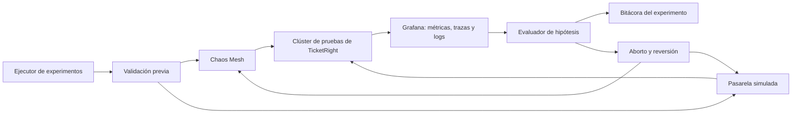

# Módulo de inyección de fallos de TicketRight

## Propósito y alcance

Este módulo permitirá provocar fallos controlados en un ambiente de pruebas para comprobar
que TicketRight conserva sus reglas de negocio, contiene el problema y recupera la operación
sin convertir una falla parcial en la caída completa de la venta. La validación no se limita a
confirmar que un servicio vuelve a iniciar: debe demostrar que no se excede el aforo, que un
pago no se cobra o procesa dos veces, que las compras iniciadas alcanzan un resultado conocido
y que el sistema reduce primero las funciones menos críticas cuando pierde capacidad.

La estrategia sigue el concepto de **degradación controlada** explicado en
[clase](../../curso/clase-03-04-transcripcion.md#15-módulo-de-inyección-de-fallos): ante una
perturbación, TicketRight debe mantener el control, informar un estado comprensible y proteger
las operaciones que ya comprometen dinero o inventario. Esto no significa ocultar todos los
problemas. Si PostgreSQL no puede confirmar una reserva, la respuesta segura es detener o
reducir nuevas admisiones y rechazar temporalmente la operación; nunca mostrar una reserva
como confirmada ni encolarla como si el aforo ya estuviera garantizado.

En esta fase se define el diseño: mecanismo, controles de seguridad, catálogo e hipótesis de
los experimentos. La instalación del módulo, su ejecución y la bitácora con evidencia real se
realizarán en la fase de implementación.

Los umbrales heredados de los atributos de calidad continúan siendo objetivos `[S]` hasta que
las pruebas los ratifiquen. Las duraciones e intensidades iniciales también son parámetros de
partida y podrán ajustarse con evidencia, sin cambiar la propiedad que cada experimento busca
demostrar.

## Contenido

| Sección | Pregunta que responde |
|---|---|
| [Qué se busca demostrar](#qué-se-busca-demostrar) | ¿Qué significa resiliencia para TicketRight? |
| [Diseño del módulo](#diseño-del-módulo) | ¿Con qué componentes se inyectarán y observarán los fallos? |
| [Controles de seguridad](#controles-de-seguridad) | ¿Cómo se limita y revierte cada perturbación? |
| [Ciclo de un experimento](#ciclo-de-un-experimento) | ¿Cómo se prepara, ejecuta y documenta una prueba? |
| [Catálogo de fallos](#catálogo-de-fallos) | ¿Qué riesgos de red, servicios, base de datos y recursos se cubrirán? |
| [Experimentos prioritarios](#experimentos-prioritarios) | ¿Cuáles pruebas representativas se ejecutarán primero? |
| [Evidencia y criterios de aceptación](#evidencia-y-criterios-de-aceptación) | ¿Cómo se decidirá si el sistema resistió? |

## Qué se busca demostrar

Un experimento será satisfactorio únicamente si comprueba el comportamiento de negocio y la
recuperación técnica. Reiniciar un pod o abrir un *circuit breaker* no basta por sí solo.

| Propiedad que se debe conservar | Comportamiento esperado bajo fallo | Evidencia principal |
|---|---|---|
| **Integridad del aforo** | Ninguna perturbación permite emitir más boletas que el aforo autorizado. PostgreSQL continúa siendo la única autoridad para confirmar una reserva o una venta. | `ticketright_oversell_total` permanece en cero y los estados persistidos coinciden con las boletas emitidas. |
| **Correspondencia entre pago y boleta** | Una respuesta tardía, repetida o perdida de la pasarela no duplica cobros ni emisiones. Los casos intermedios se reintentan, concilian o compensan hasta llegar a un estado conocido. | Pagos por estado, discrepancias abiertas, edad de la discrepancia más antigua y trazas correlacionadas. |
| **Prioridad de operaciones en curso** | Cuando disminuye la capacidad, se reducen primero el catálogo y las nuevas admisiones; las reservas y pagos iniciados conservan los recursos necesarios para terminar. | Tasa de admisión, finalización de pagos, latencia de reserva, trabajo pendiente y uso de recursos. |
| **Recuperación sin pérdida ni duplicación** | Al regresar una dependencia, los mensajes durables se reprocesan de manera idempotente y las proyecciones reconstruibles recuperan el estado de la fuente autorizada. | *Lag* de consumidores, DLQ, transiciones de estado, reconstrucción de Redis y ausencia de duplicados. |
| **Respuesta comprensible** | El fan recibe una espera, rechazo temporal o estado pendiente coherente; no se confirma una operación que el sistema no puede garantizar. | Respuesta funcional, estado visible en la interfaz, trazas y logs del mismo `correlation_id`. |

Estas propiedades concretan los escenarios [A-1 — relación entre pago y
boleta](../01-caso-de-negocio/atributos-de-calidad.md#a-1--confiabilidad-de-la-relación-entre-pago-y-boleta),
[A-2 — integridad del aforo](../01-caso-de-negocio/atributos-de-calidad.md#a-2--integridad-del-aforo),
[A-4 — fila recuperable](../01-caso-de-negocio/atributos-de-calidad.md#a-4--equidad-y-auditabilidad-de-la-fila),
[A-5 — liberación de reservas](../01-caso-de-negocio/atributos-de-calidad.md#a-5--liberación-oportuna-de-reservas-abandonadas),
[A-6 — degradación controlada](../01-caso-de-negocio/atributos-de-calidad.md#a-6--resiliencia-y-degradación-controlada)
y [A-9 — disponibilidad](../01-caso-de-negocio/atributos-de-calidad.md#a-9--disponibilidad-durante-la-ventana-de-venta).

## Diseño del módulo

### Mecanismo seleccionado

El núcleo del módulo será **Chaos Mesh**, desplegado únicamente en el clúster de pruebas de
Kubernetes. Sus experimentos declarativos permiten seleccionar objetivos por espacio de
nombres y etiquetas, definir duración e intensidad y provocar fallos de red, pods, CPU,
memoria e I/O. Sus flujos también permiten ordenar perturbaciones y comprobaciones de estado.
Estas capacidades hacen posible cubrir las cuatro dimensiones con un mecanismo común y sin
añadir rutas de fallo al código que se desplegará en producción.

Se consideró **Toxiproxy** porque permite introducir latencia, pérdida de conexión y límites
de ancho de banda de manera determinista. Es una opción apropiada para pruebas de conexiones
TCP, pero exige dirigir cada cliente a través de un proxy y no cubre por sí sola la caída de
pods ni la presión de CPU o memoria. Para TicketRight, Chaos Mesh ofrece una cobertura más
completa y se integra de forma natural con el despliegue previsto en Kubernetes.

Chaos Mesh se complementará con la **pasarela de pagos simulada** que ya forma parte del
alcance de TicketRight. Chaos Mesh reproducirá las condiciones de infraestructura —demora,
pérdida de paquetes, partición, caída de pods y presión de recursos—, mientras la pasarela
simulada reproducirá comportamientos propios del proveedor que una falla de red no expresa:
respuesta duplicada, webhook fuera de orden o confirmación posterior a un *timeout*. Ambos se
orquestan desde el mismo módulo de pruebas; ninguno requiere modificar el código de negocio.

`[V]` Chaos Mesh admite fallos de red, pods, HTTP, I/O, CPU y memoria, selección del alcance y
flujos declarativos con tiempo límite. Fuente: [documentación oficial de Chaos
Mesh](https://chaos-mesh.org/docs/basic-features/).

`[V]` Toxiproxy permite parametrizar latencia, tiempo de espera, ancho de banda y dirección
del tráfico afectado. Fuente: [repositorio oficial de
Toxiproxy](https://github.com/Shopify/toxiproxy/blob/main/README.md).

### Componentes y responsabilidades

| Componente | Responsabilidad |
|---|---|
| **Ejecutor de experimentos** | Recibe el identificador del experimento y sus parámetros, valida permisos, registra quién lo inició y coordina preparación, perturbación, comprobación y limpieza. |
| **Manifiestos de Chaos Mesh** | Definen el tipo de fallo, objetivo, dirección del tráfico, intensidad, duración y número o porcentaje máximo de pods afectados. Se conservan versionados para repetir el mismo experimento. |
| **Perfiles de la pasarela simulada** | Configuran respuestas tardías, duplicadas, fallidas o fuera de orden para comprobar idempotencia y conciliación del pago. |
| **Comprobaciones de estado estable** | Consultan la plataforma de [observabilidad](observabilidad.md) antes, durante y después de la perturbación. Impiden iniciar si el ambiente ya está degradado. |
| **Control de aborto y reversión** | Suspende el flujo, retira la perturbación y verifica la recuperación cuando se supera un límite de seguridad. |
| **Bitácora** | Relaciona hipótesis, parámetros, ventana de ejecución, resultado, enlaces a tableros y `trace_id`, debilidades encontradas y acción de mejora. |

### Parámetros comunes

Cada experimento expondrá, como mínimo, estos parámetros en configuración y no dentro del
código de TicketRight:

| Parámetro | Uso |
|---|---|
| `environment` y `namespace` | Restringen la ejecución al ambiente y espacio de nombres autorizados. |
| `target_labels` | Selecciona el servicio o dependencia objetivo mediante etiquetas explícitas. |
| `mode` y `affected_count` | Determinan si se afecta un pod, una cantidad fija o un porcentaje limitado. |
| `duration` | Establece el tiempo máximo de la perturbación y habilita su retiro automático. |
| `latency`, `jitter`, `packet_loss` y `direction` | Ajustan una falla de red sin cambiar la aplicación. |
| `cpu_load`, `memory_size` e `io_delay` | Definen la presión de recursos aplicada al objetivo. |
| `gateway_profile` | Selecciona el comportamiento tardío, duplicado, rechazado o fuera de orden de la pasarela simulada. |
| `abort_conditions` | Declara las consultas y umbrales que detienen el experimento antes de causar un daño mayor. |

Los valores iniciales se mantendrán conservadores y aumentarán por etapas. La intensidad
definitiva se establecerá después de medir el estado estable con la volumetría acordada; así
se evita elegir cifras arbitrarias que no representen la capacidad real del ambiente.

## Controles de seguridad

1. **Ambiente aislado.** La inyección estará bloqueada en producción. Solo se habilitará en
   un espacio de nombres de pruebas identificado explícitamente para caos.
2. **Autorización mínima.** La cuenta del módulo tendrá permisos únicamente sobre los tipos
   de fallo y espacios de nombres necesarios. El operador que inicia la prueba y su motivo
   quedarán registrados.
3. **Selección positiva.** Solo podrán afectarse recursos con una etiqueta de inclusión para
   pruebas. Una selección vacía, global o dirigida a la plataforma de observabilidad será
   rechazada.
4. **Radio de impacto limitado.** Se comenzará con un pod o una conexión, una duración corta
   y carga sintética. El alcance aumentará únicamente cuando el nivel anterior se recupere
   según la hipótesis.
5. **Duración y reversión obligatorias.** Ningún fallo será indefinido. El manifiesto tendrá
   tiempo máximo, el ejecutor dispondrá de cancelación manual y la limpieza eliminará la
   perturbación aunque la hipótesis falle.
6. **Datos de prueba.** Se usarán eventos, compradores y medios de pago sintéticos. No se
   inyectará corrupción destructiva en datos ni se borrarán volúmenes para demostrar una
   indisponibilidad que puede reproducirse mediante partición, latencia o caída controlada.
7. **Observabilidad independiente.** Antes de ejecutar se comprobará que métricas, trazas y
   logs están llegando. Si se pierde esa evidencia, se abortará porque no sería posible
   distinguir resiliencia de un fallo invisible.
8. **Un cambio a la vez.** La primera ejecución de cada escenario introducirá una sola
   perturbación. Las combinaciones se reservarán para cuando exista una línea base confiable.

Se detendrá de inmediato cualquier experimento si se detecta una sobreventa, una operación
confirmada sin respaldo durable, efectos fuera del alcance autorizado, exposición de datos o
pérdida de la telemetría necesaria para evaluar el resultado.

## Ciclo de un experimento

1. **Formular la hipótesis.** Se declara qué propiedad debe permanecer estable y qué
   degradación sí se considera aceptable.
2. **Preparar el ambiente.** Se carga información sintética, se inicia la volumetría y se
   confirma que los indicadores se encuentran en su rango normal.
3. **Registrar la línea base.** Se guardan versión, capacidad, configuración, métricas y una
   traza de referencia para poder comparar.
4. **Aplicar la perturbación.** El ejecutor activa el manifiesto o perfil con alcance,
   intensidad y duración explícitos.
5. **Observar y decidir.** Se comparan las métricas con la hipótesis. Si aparece una condición
   de aborto, la perturbación se retira sin esperar a completar su duración.
6. **Revertir y verificar recuperación.** Se elimina el fallo y se comprueba que los servicios
   están preparados, las colas se drenan, las proyecciones se reconstruyen y no quedan pagos
   o reservas en un estado ambiguo.
7. **Documentar y aprender.** La bitácora registra resultado, evidencia, debilidad y acción.
   Una corrección solo se considera validada cuando el mismo experimento vuelve a ejecutarse.

Un *circuit breaker*, un reintento, una DLQ o el control de admisión no son fallos inyectados;
son las defensas cuya respuesta se comprobará durante este ciclo.

## Catálogo de fallos

El catálogo parte de riesgos presentes en las decisiones de TicketRight, no de una lista
genérica. En particular, se apoya en la [SAGA de pago](../decisiones/0002-mensajeria-del-bus-de-eventos.md),
la [autoridad de inventario](../decisiones/0003-consistencia-por-tipo-de-inventario.md) y el
[escalado con control de admisión](../decisiones/0006-escalado-programado-por-ventana-de-venta.md).

| Dimensión | Fallo controlado | Riesgo real que representa | Defensa que se valida | Mecanismo |
|---|---|---|---|---|
| **Red** | Latencia, pérdida de paquetes o interrupción entre Venta y Recaudo y la pasarela | La solicitud vence localmente, pero el proveedor puede confirmar el cobro después | *Timeouts* acotados, *circuit breaker*, estado durable, idempotencia y conciliación | `NetworkChaos` y perfil tardío de la pasarela simulada |
| **Red** | Partición temporal entre un consumidor y Kafka | Los eventos quedan pendientes y el consumidor puede recibirlos nuevamente al recuperarse | Persistencia del evento, reanudación desde el *offset*, idempotencia y alerta por *lag* | `NetworkChaos` dirigido por etiquetas y puerto |
| **Servicios** | Reinicio del coordinador SAGA durante una compra | El proceso puede detenerse entre la confirmación del pago y la emisión de la boleta | Estado durable, reinicio, reintento y emisión única | `PodChaos` sobre una réplica |
| **Servicios** | Indisponibilidad de Redis | La fila o las vistas de disponibilidad pierden su proyección rápida | Registro durable, reconstrucción de proyecciones y protección de PostgreSQL ante una avalancha de consultas | `NetworkChaos` o `PodChaos` en el ambiente local |
| **Servicios** | Indisponibilidad temporal de emisión | Existen pagos confirmados cuya boleta todavía no puede emitirse | Reintentos con espera progresiva, DLQ, conciliación y prioridad de pagos iniciados | `PodChaos` sobre el servicio de emisión |
| **Base de datos** | Interrupción o latencia del acceso a PostgreSQL desde inventario | La aplicación podría dejar reservas inciertas o confirmar aforo sin autoridad durable | Rechazo controlado, reducción de admisión y ausencia de confirmaciones falsas | `NetworkChaos` sobre el tráfico del cliente hacia PostgreSQL |
| **Base de datos** | Contención sobre las últimas boletas de una localidad | Muchas transacciones compiten por el mismo inventario y aumentan bloqueos o reintentos | Operación atómica, unicidad, reintentos acotados y cero sobreventa | Carga concurrente sintética más demora controlada de la conexión |
| **Base de datos** | Agotamiento controlado del cupo de conexiones | Un aumento de réplicas o comandos puede saturar la base antes que la CPU de los servicios | Límite de concurrencia, *back pressure* y reducción de admisiones | Perfil de carga acotado y límite de conexiones del ambiente de pruebas |
| **Recursos** | Presión de CPU o memoria en admisión o catálogo | La demanda masiva consume capacidad que no debe competir con reservas y pagos | Aislamiento, escalado y degradación primero de funciones no críticas | `StressChaos` sobre un pod o porcentaje limitado |
| **Recursos** | Presión de CPU en un consumidor de pago o emisión | Crece el trabajo pendiente y puede incumplirse el tiempo de conciliación | Escalado por *lag*, capacidad reservada, DLQ y drenaje antes de reducir capacidad | `StressChaos` sobre una réplica del consumidor |

## Experimentos prioritarios

La primera campaña utilizará cinco experimentos representativos. Juntos cubren las cuatro
dimensiones y los riesgos más importantes del recorrido admisión → reserva → pago → emisión.
Los demás fallos del catálogo se incorporarán cuando estos escenarios sean repetibles.

### IF-01 — La pasarela responde tarde y repite la confirmación

- **Estado estable:** el recorrido de compra está disponible, no existen discrepancias
  antiguas ni mensajes en DLQ y una compra sintética termina con una sola boleta.
- **Hipótesis:** si la respuesta de la pasarela llega después del *timeout* y el webhook se
  entrega dos veces, TicketRight mantendrá una sola intención de pago y una sola emisión. La
  compra llegará a boleta emitida o compensación confirmada dentro de 15 minutos.
- **Perturbación:** añadir al tráfico hacia la pasarela una demora superior al *timeout* del
  cliente y configurar el simulador para enviar dos veces la misma confirmación, conservando
  la misma clave de idempotencia. Duración inicial: una compra sintética.
- **Comportamiento esperado:** el *circuit breaker* contiene nuevas llamadas cuando
  corresponde; la SAGA conserva el estado pendiente; el evento repetido no crea otra
  transición y la conciliación resuelve la ambigüedad.
- **Verificación:** `ticketright_payments_total{state}`,
  `ticketright_open_discrepancies`, `ticketright_oldest_discrepancy_age_seconds`, DLQ y la
  traza completa del `correlation_id` de prueba.
- **Aborto:** cualquier cobro o boleta duplicada, una sobreventa, una discrepancia que alcance
  10 minutos sin una ruta de recuperación activa o pérdida de trazabilidad.
- **Reversión:** retirar la demora, volver la pasarela al perfil normal y esperar a que la
  SAGA termine o compense antes de cerrar el experimento.

### IF-02 — Reinicio del coordinador de pago durante el procesamiento

- **Estado estable:** todas las réplicas están preparadas, el consumidor no tiene atraso y
  las compras sintéticas alcanzan un estado final.
- **Hipótesis:** si una réplica del coordinador SAGA se reinicia mientras existen pagos en
  curso, otra réplica o la réplica recuperada retomará el estado durable sin perder el evento
  ni repetir el efecto monetario o la emisión.
- **Perturbación:** `PodChaos` elimina una sola réplica del coordinador durante un lote
  controlado de compras. La pasarela simulada mantiene algunas confirmaciones pendientes para
  asegurar que haya procesos en estados intermedios.
- **Comportamiento esperado:** Kubernetes repone la réplica, Kafka vuelve a entregar el
  trabajo no confirmado y la idempotencia convierte cualquier repetición en el mismo
  resultado de negocio.
- **Verificación:** réplicas preparadas, reinicios, *lag*, reintentos, pagos por estado,
  discrepancias y trazas antes y después del reinicio.
- **Aborto:** cero réplicas preparadas durante más de un minuto, finalización de pagos por
  debajo de 99% durante cinco minutos, duplicación o crecimiento de DLQ sin consumo.
- **Reversión:** detener `PodChaos`, confirmar la réplica recuperada y drenar el trabajo
  pendiente antes de iniciar otro experimento.

### IF-03 — PostgreSQL deja de estar disponible para nuevas reservas

- **Estado estable:** la latencia P95 de reserva es menor o igual a dos segundos, no hay
  reservas vencidas sin liberar y la base no presenta saturación previa.
- **Hipótesis:** si inventario pierde temporalmente acceso a PostgreSQL, ninguna reserva se
  marcará como confirmada sin una transacción durable. El sistema reducirá nuevas admisiones,
  dará una respuesta temporal controlada y conservará la atención de los pagos ya iniciados.
- **Perturbación:** `NetworkChaos` bloquea inicialmente durante 30 segundos `[S]` el tráfico
  desde una réplica de inventario hacia PostgreSQL. Una segunda etapa podrá ampliar el alcance
  únicamente después de aprobar la primera.
- **Comportamiento esperado:** aumentan rechazos temporales o espera, no las confirmaciones;
  el control de admisión reduce el caudal y la recuperación no reprocesa a ciegas solicitudes
  cuyo resultado nunca fue persistido.
- **Verificación:** confirmaciones y errores de reserva, latencia, conexiones, admisiones,
  `ticketright_oversell_total`, pagos en curso y trazas de las solicitudes afectadas.
- **Aborto:** una reserva visible como confirmada sin registro durable, cualquier sobreventa,
  afectación de pagos iniciados o propagación del fallo a un espacio de nombres no autorizado.
- **Reversión:** retirar la partición, comprobar conectividad y consistencia y aumentar la
  admisión gradualmente; no liberar de golpe toda la fila hacia PostgreSQL.

### IF-04 — Pérdida de la proyección de fila en Redis

- **Estado estable:** la fila responde dentro de su objetivo, el registro durable y Redis
  coinciden y PostgreSQL no recibe consultas masivas de posición.
- **Hipótesis:** si Redis deja de estar disponible, TicketRight no alterará el orden durable
  ni consultará PostgreSQL por cada actualización de posición. La vista se marcará como
  temporalmente no disponible y se reconstruirá sin cambiar reservas o ventas confirmadas.
- **Perturbación:** aislar inicialmente durante 30 segundos `[S]` el tráfico de admisión hacia
  Redis en el ambiente de pruebas.
- **Comportamiento esperado:** se pausa o limita la actualización visible de posiciones, se
  reduce la admisión si es necesario y, al regresar Redis, la proyección se reconstruye desde
  el registro autorizado.
- **Verificación:** latencia de consulta de posición, tasa de admisión, carga de PostgreSQL,
  tiempo de reconstrucción, diferencias de orden y trazas de usuarios sintéticos.
- **Aborto:** cambio del orden durable, aumento no controlado de conexiones a PostgreSQL,
  confirmación basada únicamente en Redis o falta de una ruta de reconstrucción.
- **Reversión:** restaurar la conexión, ejecutar la reconstrucción, comparar la proyección con
  el registro durable y reabrir admisiones de manera gradual.

### IF-05 — Saturación de CPU en admisión y catálogo

- **Estado estable:** la demanda sintética es estable, los servicios críticos tienen sus
  réplicas preparadas y las reservas y pagos cumplen sus objetivos.
- **Hipótesis:** si un pod de admisión o catálogo sufre presión de CPU, aumentará la espera o
  disminuirán nuevas admisiones antes de degradarse las reservas y pagos en curso. El
  escalamiento no enviará más trabajo del que PostgreSQL y la pasarela pueden aceptar.
- **Perturbación:** `StressChaos` aplica inicialmente 80% de carga de CPU durante 60 segundos
  a un solo pod. `[S]` Estos valores son un punto de partida y deberán ajustarse con la línea
  base del ambiente.
- **Comportamiento esperado:** aparecen señales de saturación, el pod afectado pierde parte de
  su capacidad, el control de flujo reduce entradas y las compras ya iniciadas conservan su
  tasa de finalización.
- **Verificación:** CPU, memoria, réplicas, tasa de admisión, latencia de fila y reserva,
  finalización de pagos, conexiones de PostgreSQL y errores por servicio.
- **Aborto:** finalización de pagos menor a 99% durante cinco minutos, cero réplicas
  preparadas de un servicio crítico, sobreventa o incapacidad de retirar la presión.
- **Reversión:** eliminar `StressChaos`, comprobar que latencia y errores regresan a la línea
  base y mantener capacidad hasta drenar todo el trabajo pendiente.

## Evidencia y criterios de aceptación

La [plataforma de observabilidad](observabilidad.md) será el sistema de medición de los
experimentos. Cada ejecución conservará la siguiente evidencia:

- manifiesto y parámetros exactos de la perturbación;
- ambiente, versión de TicketRight, volumetría, hora de inicio y duración;
- captura o enlace temporal del tablero antes, durante y después del fallo;
- al menos un `trace_id` o `correlation_id` afectado, con sus logs relacionados;
- valores de las métricas que confirman o refutan la hipótesis;
- condición de aborto, si ocurrió, y evidencia de la reversión;
- debilidad encontrada, acción correctiva, responsable y resultado de la repetición.

Un experimento se marcará como **aprobado** cuando se conserve la invariante de negocio, la
degradación coincida con lo previsto, la recuperación termine sin trabajo ambiguo y exista
evidencia suficiente para reconstruir lo ocurrido. Se marcará como **fallido** si una sola de
esas condiciones no se cumple, aunque el servicio vuelva a aparecer como disponible.

La bitácora usará este formato:

| Campo | Contenido |
|---|---|
| Identificación | Código, fecha, responsable, versión y ambiente |
| Hipótesis | Estado estable y comportamiento que se esperaba conservar |
| Perturbación | Tipo, objetivo, parámetros, duración y radio de impacto |
| Resultado | Aprobado, fallido o abortado, con explicación breve |
| Evidencia | Tablero, métricas, trazas, logs y configuración ejecutada |
| Aprendizaje | Debilidad o supuesto confirmado |
| Acción | Mejora, responsable y fecha prevista |
| Repetición | Nueva ejecución que confirma o rechaza la mejora |

## Supuestos y pendientes

- `[S]` La ejecución inicial se realizará en Kubernetes local o en un ambiente de pruebas
  aislado con una topología representativa; no se habilitará inyección en producción.
- `[S]` Los servicios propagarán `trace_id` y `correlation_id` y expondrán las métricas
  definidas en observabilidad antes de iniciar la campaña.
- `PENDIENTE: definir el timeout, máximo de reintentos y espera progresiva de cada cliente
  después de medir la latencia normal del ambiente.`
- `PENDIENTE: relacionar cada experimento con la volumetría definitiva y ajustar intensidad,
  duración y tiempo esperado de recuperación a partir de esa línea base.`
- `PENDIENTE: implementar los manifiestos, controles previos, cancelación y bitácora; ejecutar
  los cinco experimentos y anexar evidencia en la fase de implementación.`

## Referencias

- [Explicación del módulo y la degradación controlada en clase](../../curso/clase-03-04-transcripcion.md#15-módulo-de-inyección-de-fallos).
- [Material de clase: tolerancia a fallos en arquitecturas basadas en eventos](../../curso/clase-03-04.md#12-estilo-event-driven-basado-en-eventos).
- [AD-002 — SAGA, eventos durables e idempotencia](../decisiones/0002-mensajeria-del-bus-de-eventos.md).
- [AD-003 — PostgreSQL como autoridad y proyecciones reconstruibles](../decisiones/0003-consistencia-por-tipo-de-inventario.md).
- [AD-006 — control de admisión, escalado y recuperación](../decisiones/0006-escalado-programado-por-ventana-de-venta.md).
- [Chaos Mesh — características y tipos de fallos](https://chaos-mesh.org/docs/basic-features/).
- [Chaos Mesh — control del espacio de nombres habilitado](https://chaos-mesh.org/docs/configure-enabled-namespace/).
- [Chaos Mesh — definición de flujos de experimentos](https://chaos-mesh.org/docs/create-chaos-mesh-workflow/).
