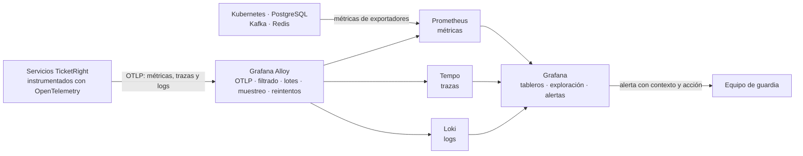

# Plataforma de observabilidad de TicketRight

## Propósito y alcance

La observabilidad de TicketRight debe permitir responder, con evidencia, tres preguntas:

1. **¿La venta está funcionando para el fan y para el promotor?**
2. **¿En qué punto exacto se degrada una transacción?**
3. **¿Puede el equipo actuar antes de que una anomalía pequeña se convierta en una caída o
   en una discrepancia entre dinero y boleta?**

El documento define el monitoreo, las métricas, las trazas, los logs, los tableros y las
alertas de la solución. Combina una **vista de negocio**, centrada en ventas, conversión,
aforo y conciliación, con una **vista técnica**, centrada en disponibilidad, rendimiento,
errores, saturación y dependencias. La plataforma en operación deberá respaldar este diseño
con telemetría real e instrumentación visible en el código.

## Contenido

| Sección | Pregunta que responde |
|---|---|
| [Plataforma Grafana](#plataforma-grafana) | ¿Qué componentes la conforman y qué aporta cada uno? |
| [Arquitectura de observabilidad](#arquitectura-de-observabilidad) | ¿Cómo viajan métricas, trazas y logs? |
| [Indicadores principales](#indicadores-principales) | ¿Cuáles son las cinco señales que resumen la salud de una venta? |
| [Catálogo de métricas](#catálogo-de-métricas-y-objetivos) | ¿Qué se mide, con qué umbral y para qué atributo? |
| [Trazas distribuidas](#trazas-distribuidas) | ¿Cómo se reconstruye una transacción completa? |
| [Logs](#logs-estructurados-y-seguros) | ¿Qué se registra, correlaciona y conserva? |
| [Tableros](#tableros) | ¿Qué preguntas operativas responde cada vista? |
| [Alertas](#alertas-accionables) | ¿Quién actúa, cuándo y con qué prioridad? |
| [Validación posterior](#validación-posterior-del-diseño) | ¿Cómo se comprobará el diseño cuando exista la implementación? |

## Plataforma Grafana

La plataforma de observabilidad de TicketRight se implementará con **Grafana de código
abierto (OSS)**. Grafana
centralizará la visualización, la exploración correlacionada y el alertamiento sobre
métricas, trazas y logs, y se desplegará en contenedores junto con los servicios de la
aplicación.

Los siguientes componentes se integran con Grafana para recolectar, procesar y almacenar
cada tipo de señal:

| Responsabilidad | Componente | Justificación para TicketRight |
|---|---|---|
| Instrumentación | **OpenTelemetry SDK** | El kit de instrumentación genera y propaga el contexto desde la admisión hasta la reserva, el pago y la emisión, tanto en llamadas HTTP como en eventos de Kafka. |
| Recepción y procesamiento | **Grafana Alloy** | Recibe la telemetría mediante OTLP, el protocolo de OpenTelemetry; añade los datos del ambiente, filtra información sensible y aplica lotes, reintentos y muestreo sin cargar esa responsabilidad en cada servicio. |
| Métricas | **Prometheus** | Conserva los indicadores numéricos que permiten vigilar disponibilidad, latencia, pagos, discrepancias, aforo, colas y consumo de infraestructura. |
| Trazas | **Grafana Tempo** | Reconstruye por `trace_id` el recorrido distribuido de una compra y permite localizar en qué servicio o dependencia aumentó la latencia o se produjo un error. |
| Logs | **Grafana Loki** | Centraliza los registros estructurados de los servicios y permite consultarlos desde una traza sin propagar datos personales innecesarios. |
| Visualización y alertas | **Grafana** | Reúne las vistas de negocio y operación, relaciona las tres señales y notifica al responsable cuando un umbral requiere intervención. |
| Recursos de infraestructura | Exportadores de Kubernetes, PostgreSQL, Kafka y Redis | Permiten relacionar una degradación de la compra con saturación de pods, bloqueos de base de datos, atraso de consumidores o presión de memoria. |

Esta integración responde al comportamiento de TicketRight: la venta atraviesa servicios
síncronos, procesamiento asíncrono y una pasarela externa; la demanda se concentra en
ventanas cortas; y una falla puede dejar dinero, inventario y emisión en estados distintos.
Por eso no basta con observar servidores: es necesario correlacionar la transacción de
negocio con el estado de la infraestructura que la procesa.

### Por qué se eligió Grafana

Antes de definir la plataforma se revisaron **Grafana OSS** y **Dynatrace**. Las dos permiten
trabajar con métricas, trazas y logs, y las dos pueden recibir telemetría generada con
OpenTelemetry. La diferencia principal para TicketRight no está en si pueden observar una
transacción, sino en la forma de adoptarlas y operarlas durante el piloto.

| Aspecto | Grafana OSS | Dynatrace | Lectura para TicketRight |
|---|---|---|---|
| Cobertura | Integra métricas, trazas, logs, tableros y alertas mediante Prometheus, Tempo y Loki | Ofrece estas capacidades en una plataforma administrada | Las dos cubren las señales necesarias para seguir una venta. |
| Adopción | Permite desplegar un núcleo inicial y ampliar la instrumentación de forma gradual; cuenta con documentación y una comunidad amplia | Reúne las capacidades en una experiencia integrada, pero requiere familiarizarse con su modelo de plataforma y análisis | Grafana ofrece una curva de aprendizaje manejable para el equipo y permite avanzar por etapas. |
| Costo | Su edición OSS no requiere licencias y puede comenzar con un despliegue pequeño; sigue existiendo costo de infraestructura y operación | Su costo depende de la suscripción y del volumen de telemetría procesado | Grafana permite mantener contenido el costo inicial y aumentar capacidad solo cuando la carga lo exija. |
| Integraciones | Se integra con OpenTelemetry y dispone de fuentes de datos y exportadores para Kubernetes, PostgreSQL, Kafka, Redis y otros componentes | También dispone de integraciones para aplicaciones e infraestructura | Las integraciones de Grafana coinciden directamente con las tecnologías previstas para TicketRight. |
| Portabilidad | Utiliza componentes abiertos e instrumentación OpenTelemetry | También recibe OpenTelemetry, con capacidades adicionales propias de la plataforma | OpenTelemetry permite conservar la instrumentación si la estrategia cambia más adelante. |
| Ajuste al equipo | Sus consultas se incorporan progresivamente: PromQL para métricas, LogQL para logs y TraceQL para trazas | Requiere aprender sus herramientas, consultas y modelo operativo | Grafana permite aprender primero lo necesario para el recorrido crítico y ampliar después los análisis. |

Grafana ofrece el equilibrio más conveniente para esta etapa: puede ejecutarse junto con la
aplicación en el ambiente de contenedores, tiene un costo de adopción contenido y ofrece
integraciones directas con las tecnologías de TicketRight. Su curva de aprendizaje es
manejable porque la plataforma puede incorporarse por etapas, empezando por el recorrido
crítico de compra. Además, permite navegar de una métrica a una traza y luego a los logs de
la misma operación. Dynatrace también es una alternativa técnicamente válida, pero Grafana
se ajusta mejor a la necesidad actual de flexibilidad, integración y crecimiento gradual.

## Arquitectura de observabilidad



Cada señal comparte como mínimo `service.name`, `service.version`,
`deployment.environment` y el perfil operativo (`cotidiano`, `preparacion`, `pico` o
`recuperacion`). Métricas y logs incorporan enlaces hacia la traza relacionada. Desde una
latencia anormal debe ser posible abrir un ejemplo de traza y, desde uno de sus spans,
consultar los logs del mismo servicio y periodo.

No se usarán identificadores de usuario, correo, documento, `venta_id`, `reserva_id` o
`trace_id` como etiquetas de Prometheus: su cardinalidad crecería sin límite. Los
identificadores opacos sí pueden aparecer en trazas y logs protegidos cuando sean necesarios
para investigar una operación concreta.

## Indicadores principales

Estos cinco indicadores estarán visibles en la cabecera del tablero operativo porque, en
conjunto, cubren el recorrido crítico y los riesgos que pueden comprometer una venta:
acceso al servicio, tiempo de respuesta, continuidad del pago, correspondencia entre dinero
y boleta, e integridad del aforo. Cada indicador representa una clase de fallo diferente y
conduce a las métricas técnicas necesarias para localizar su causa.

| Indicador | Qué permite saber | Cómo se calcula | Objetivo operativo `[S]` | Origen de los datos |
|---|---|---|---|---|
| **Disponibilidad del recorrido crítico** | Si un fan puede ingresar, reservar e iniciar el pago durante una ventana de venta | Porcentaje de recorridos sintéticos exitosos frente al total ejecutado dentro de la ventana | **≥ 99,9%** de recorridos exitosos | Sonda sintética que ejecuta el recorrido desde el exterior; Prometheus conserva sus resultados |
| **Tiempo de respuesta de la reserva** | Si un usuario admitido recibe a tiempo una confirmación o un rechazo definitivo, sin quedar en un estado incierto | Percentil 95 del tiempo transcurrido desde que el gateway recibe la solicitud hasta que inventario responde; también se calcula la proporción de errores técnicos | **P95 ≤ 2 segundos** y errores técnicos **< 1%** | Spans y métricas OpenTelemetry generados por el gateway y el servicio de inventario/venta |
| **Finalización de pagos iniciados** | Si una condición de saturación está dejando compras en curso sin resolver | Porcentaje de pagos iniciados que llegan a un estado final conocido —boleta emitida o compensación confirmada— frente al total iniciado durante el periodo | **≥ 99%** de los pagos iniciados llega a un estado final controlado | Estados persistidos por el coordinador durable del proceso de pago (SAGA), eventos de la pasarela y resultado del servicio de emisión |
| **Discrepancias entre dinero y boleta** | Si existen pagos confirmados que todavía no tienen boleta emitida ni compensación completada | Número de discrepancias abiertas y tiempo transcurrido desde la confirmación del pago más antiguo aún pendiente | Antigüedad máxima **≤ 15 minutos** y **cero discrepancias abiertas** al cierre de la operación | Estado del coordinador de pago, eventos de pago y emisión, y resultados del proceso de conciliación |
| **Integridad del aforo** | Si el sistema conserva el límite autorizado aun con concurrencia, reintentos o fallos | Comparación entre el aforo autorizado y el total de boletas válidas emitidas por localidad y evento | **Cero boletas emitidas por encima del aforo autorizado** | Autoridad transaccional de inventario en PostgreSQL y eventos confirmados de emisión |

Los objetivos se expresan como condiciones verificables. El porcentaje indica la proporción
que debe cumplir el sistema; P95 significa que al menos 95 de cada 100 solicitudes deben
responder dentro del tiempo indicado; y «cero» señala una condición que no admite ocurrencias
durante la medición. Todos los valores marcados `[S]` son metas operativas pendientes de
ratificación y deberán comprobarse con telemetría real.

La disponibilidad confirma que el recorrido puede iniciarse; la latencia comprueba que la
reserva sigue siendo utilizable bajo carga; la finalización de pagos protege las compras ya
iniciadas; las discrepancias revelan fallos de conciliación; y la integridad del aforo vigila
una restricción legal y operativa que no admite compensación posterior. Los indicadores se
derivan de A-1, A-2, A-6, A-9 y A-10 de
[`atributos-de-calidad.md`](../01-caso-de-negocio/atributos-de-calidad.md). CPU, memoria o
número de réplicas ayudan a encontrar la causa, pero no reemplazan estas medidas: el usuario
percibe disponibilidad, errores y latencia, no utilización de CPU.

## Catálogo de métricas y objetivos

Las métricas de servicio explican si las funciones críticas están disponibles y responden
correctamente. Las métricas de negocio muestran si ese comportamiento técnico conserva las
promesas de TicketRight: respetar el aforo, mantener la relación entre pago y boleta y
producir una venta económicamente sostenible.

En los tableros se utilizará un nombre descriptivo en español. La variable en inglés es el
identificador estable que emplearán el código y Prometheus. Un **contador** acumula hechos
que ya ocurrieron, una **medición actual** sube o baja con el estado del sistema y un
**histograma** agrupa duraciones para calcular percentiles como P95.

### Métricas de servicio

| Nombre en el tablero y variable técnica | Qué mide y cómo debe interpretarse | Objetivo operativo `[S]` | Justificación y origen del dato |
|---|---|---|---|
| **Disponibilidad del recorrido de compra**<br/>`ticketright_critical_journey_checks_total{result}` | Contador de recorridos sintéticos exitosos y fallidos. La disponibilidad se calcula dividiendo los recorridos exitosos entre todos los ejecutados durante una ventana de venta. | **≥ 99,9%** dentro de las ventanas declaradas. | Permite confirmar desde fuera de la aplicación que un fan puede ingresar, reservar e iniciar el pago. La sonda sintética genera el resultado y Prometheus lo conserva. Respalda A-9. |
| **Tiempo de confirmación de una reserva**<br/>`ticketright_reservation_duration_seconds` | Histograma del tiempo completo entre la recepción de la solicitud y la confirmación o rechazo definitivo del inventario. No mide únicamente el tiempo de la base de datos. | **P95 ≤ 2 segundos** y errores técnicos **< 1%**. | Una reserva lenta o ambigua provoca reintentos y puede aumentar la competencia por el mismo inventario. El gateway y el servicio de inventario/venta generan la medición mediante OpenTelemetry. Respalda A-10. |
| **Tiempo de consulta de la posición en fila**<br/>`ticketright_queue_position_duration_seconds` | Histograma del tiempo que tarda TicketRight en devolver al fan su estado y posición aproximada en la fila. | **P95 ≤ 1 segundo** durante el perfil de pico. | Las consultas de la multitud deben resolverse sin cargar la autoridad transaccional del inventario. Admisión genera la métrica y la vista de fila en Redis aporta el resultado consultado. Respalda A-10 y permite detectar saturación antes de afectar las reservas. |
| **Pagos iniciados que alcanzan un resultado final**<br/>`ticketright_payments_total{state}` | Contador de pagos por estado. El indicador divide los pagos que terminan con boleta emitida o compensación confirmada entre todos los pagos iniciados durante el periodo observado. | **≥ 99%** alcanza un estado final controlado durante saturación. Por separado, la meta comercial establece que al menos **98%** de quienes inician el pago deben completar la compra sin error. | Permite distinguir una compra rechazada de manera controlada de una transacción perdida en un estado intermedio. La SAGA de pago, la pasarela y emisión producen los cambios de estado. Respalda A-6 y el [objetivo de confianza del fan](../01-caso-de-negocio/caso-de-negocio-corporativo.md#okr-2-confianza-del-fan). |
| **Discrepancias abiertas entre pago y boleta**<br/>`ticketright_open_discrepancies` | Medición actual del número de pagos confirmados que todavía no tienen una boleta emitida ni una compensación completada. Puede aumentar durante el procesamiento y debe volver a cero. | **Cero** al cierre de la operación. | Hace visible el riesgo central del negocio: que exista dinero confirmado sin un derecho de entrada resuelto. El conciliador calcula el valor a partir de los estados durables de pago y emisión. Respalda A-1. |
| **Antigüedad de la discrepancia más antigua**<br/>`ticketright_oldest_discrepancy_age_seconds` | Medición actual de los segundos transcurridos desde la confirmación del pago pendiente más antiguo. Si no hay discrepancias, el valor es cero. | **≤ 900 segundos**, equivalentes a 15 minutos. | El número de casos abiertos no indica por sí solo su urgencia. Esta métrica permite intervenir antes de incumplir el tiempo máximo de conciliación. Se calcula con la fecha de confirmación conservada por la SAGA y el conciliador. Respalda A-1. |
| **Reservas vencidas aún sin liberar**<br/>`ticketright_overdue_reservations` | Medición actual de reservas no pagadas que ya superaron su vencimiento y continúan reteniendo inventario. | **Cero** reservas no pagadas con más de 10 minutos desde su creación. | Una reserva abandonada reduce las boletas disponibles y afecta la conversión de la venta. El servicio de inventario compara `expires_at`, estado de pago y estado de liberación. Respalda A-5. |

### Métricas de negocio e integridad

| Nombre en el tablero y variable técnica | Qué mide y cómo debe interpretarse | Objetivo operativo `[S]` | Justificación y origen del dato |
|---|---|---|---|
| **Sobreventas detectadas**<br/>`ticketright_oversell_total` | Contador de ocasiones en las que las boletas válidas emitidas superan el aforo autorizado de una localidad o evento. | **Cero** en todos los eventos y escenarios de operación. | El aforo es una restricción legal y operativa; una compensación posterior no corrige su incumplimiento. La autoridad transaccional en PostgreSQL y los eventos confirmados de emisión permiten comparar capacidad y emisión. Respalda A-2. |
| **Conflictos de titularidad de una boleta**<br/>`ticketright_invalid_ownership_total` | Contador de casos en los que una misma boleta aparece con más de una titularidad activa o credencial válida al mismo tiempo. | **Cero** durante emisión, transferencia, reventa y anulación. | La transferencia y la reventa solo son confiables si existe un único derecho vigente. El contexto de Derecho de asistencia genera la métrica al comprobar sus reglas de transición. Respalda A-3. |
| **Incumplimientos de la política de fila**<br/>`ticketright_queue_policy_violations_total` | Contador de turnos admitidos en un orden distinto al definido por la política publicada para el evento. | **Cero**; el 100% de los turnos debe ser explicable y reconstruible. | La fila es parte de la promesa de equidad de TicketRight. Admisión compara el orden registrado, la política vigente y la secuencia real de ingreso. Respalda A-4. |
| **Usuarios activos en la venta**<br/>`ticketright_active_sale_sessions` | Medición actual de sesiones que han interactuado con la fila o el recorrido de compra durante los últimos cinco minutos. | No tiene una meta aislada; se interpreta junto con admisiones, reservas, pagos y capacidad disponible. | Permite comprender el tamaño de la demanda real y explicar cambios en latencia o saturación. El gateway y Admisión actualizan la actividad sin usar datos personales como etiquetas. |
| **Movimientos de boletas por estado**<br/>`ticketright_ticket_state_transitions_total{state}` | Contador de transiciones hacia los estados del [modelo de dominio](modelo-de-dominio.md#tipos-y-enumeraciones): `emitida`, `transferida`, `revendida` o `anulada`. La boleta nace al emitirse; lo que se reserva es un ítem de reserva, que se cuenta en `ticketright_active_sale_sessions` y en las métricas de reserva. Las diferencias entre estados construyen el embudo de la venta. | Las cantidades deben ser coherentes con el aforo y con los estados de pago; reventas y anulaciones se siguen contra sus metas de negocio. | Permite saber cuántas intenciones terminan en una boleta válida y seguir la adopción de transferencia y reventa. Inventario, emisión y Derecho de asistencia publican las transiciones confirmadas. Aporta a los objetivos de [confianza del fan](../01-caso-de-negocio/caso-de-negocio-corporativo.md#okr-2-confianza-del-fan) y [adopción de servicios complementarios](../01-caso-de-negocio/caso-de-negocio-corporativo.md#okr-4-servicios-complementarios-adoptados). |
| **Valor acumulado de ventas confirmadas**<br/>`ticketright_sales_amount_total{currency}` | Contador monetario que suma únicamente pagos confirmados, separado por moneda. Devoluciones y compensaciones se registran en una métrica equivalente para calcular el valor neto. | No tiene un umbral operativo único; se compara con la proyección y el resultado esperado de cada evento. | Relaciona la salud técnica con el resultado económico y evita estimar ingresos a partir de solicitudes o logs. Venta y recaudo producen el dato después de confirmar el pago. Aporta al objetivo de [rentabilidad por evento](../01-caso-de-negocio/caso-de-negocio-corporativo.md#okr-3-rentabilidad-por-evento). |
| **Costo de infraestructura por boleta vendida**<br/>`ticketright_infrastructure_cost_per_ticket_cop` | Medición calculada al dividir el costo de preparación, pico y recuperación entre las boletas vendidas en la corrida o evento. | **≤ COP $150 por boleta vendida** bajo la carga definida. | Permite comprobar que la elasticidad soporta el pico sin eliminar la viabilidad económica. Se obtiene de los costos etiquetados de infraestructura y del total confirmado de boletas vendidas. Respalda A-7. |

Los identificadores de evento solo se usarán como dimensión mientras el conjunto de eventos
activos sea pequeño y controlado. Los estados tendrán valores enumerados y documentados para
que una misma variable no cambie de significado entre servicios. No se crearán etiquetas
con texto libre ni con identificadores de personas, reservas, pagos o transacciones, porque
además de exponer información innecesaria producirían un número de series difícil de operar.

### Métricas técnicas de diagnóstico

Estas métricas explican por qué cambia un indicador de servicio o de negocio. Una variación
aislada de CPU o memoria no representa necesariamente una falla; adquiere importancia cuando
se mantiene en el tiempo, reduce la capacidad disponible o coincide con un aumento de
latencia y errores. Se utilizarán:

- tasa, errores y duración por servicio y operación;
- CPU, memoria, reinicios, réplicas disponibles y tiempo de arranque de pods;
- conexiones, bloqueos, *deadlocks* y latencia de consultas de PostgreSQL;
- retraso de los consumidores de Kafka, edad del mensaje más antiguo, reintentos y elementos
  enviados a la cola de mensajes que agotaron sus reintentos (DLQ);
- uso de memoria, expulsiones y tasa de aciertos de Redis;
- retraso y divergencias de las proyecciones de consulta utilizadas para separar lecturas y
  escrituras (CQRS);
- spans, métricas o logs descartados por Alloy, Tempo, Prometheus o Loki.

### Estado de los servicios desplegados

Grafana mostrará una fila por servicio con su versión, ambiente, réplicas esperadas y
disponibles, resultado de las comprobaciones de salud, tasa de errores, latencia y estado de
sus dependencias. El estado resumido no dependerá de una sola señal, sino de la capacidad
real del servicio para recibir tráfico y completar su responsabilidad.

| Estado mostrado | Condición general | Interpretación operativa |
|---|---|---|
| **Operativo** | Las réplicas necesarias están disponibles, las comprobaciones de preparación responden y los errores y la latencia se mantienen dentro de sus objetivos | El servicio puede recibir la carga prevista y no requiere intervención. |
| **En observación** | Aparece una señal temprana, como uso sostenido de recursos, reinicios aislados o crecimiento del trabajo pendiente, pero todavía no se incumple un objetivo de servicio | El equipo debe revisar la tendencia y preparar una acción antes de que el usuario resulte afectado. |
| **Degradado** | Falta al menos una parte de la capacidad, aumentan errores o latencia, o una dependencia obliga a reducir funcionalidad, aunque el recorrido crítico continúa disponible | Se requiere intervención y seguimiento hasta recuperar la capacidad normal. |
| **No disponible** | No existen réplicas preparadas o el servicio no puede cumplir su función crítica | Se activa una alerta crítica y se aplica el procedimiento de recuperación o degradación controlada. |
| **Sin telemetría** | El servicio dejó de reportar datos o la plataforma no puede consultar la señal | El estado es desconocido; nunca debe mostrarse como saludable por ausencia de errores. |

Las comprobaciones de **vida** indicarán si el proceso debe reiniciarse; las de
**preparación** indicarán si puede recibir tráfico; y las de **inicio** evitarán reiniciar un
componente que todavía está cargando dependencias o reconstruyendo una proyección. Un
despliegue se considerará sano cuando la nueva versión tenga réplicas preparadas, no aumente
la tasa de error y mantenga los objetivos de latencia durante el periodo de observación. La
separación entre estas comprobaciones sigue el comportamiento definido por
[Kubernetes](https://kubernetes.io/docs/concepts/workloads/pods/probes/): una falla de
preparación retira temporalmente el pod del tráfico, mientras una falla de vida puede
provocar su reinicio.

La observabilidad también debe observarse a sí misma. Si Alloy descarta datos o
Grafana no puede consultar uno de sus backends, el tablero mostrará explícitamente que existe
un vacío de evidencia; no interpretará la ausencia de datos como «todo está bien».

## Trazas distribuidas

### Propagación del contexto

- En HTTP se utilizará el estándar W3C `traceparent` y `tracestate`.
- El borde no confiará ciegamente en identificadores enviados desde Internet: validará el
  encabezado o iniciará una nueva traza antes de entrar a la red interna.
- Cada evento de Kafka transportará el contexto de traza en sus encabezados. Productores y
  consumidores crearán spans que permitan seguir la relación causal aun cuando el consumo
  ocurra segundos después.
- Los logs recibirán automáticamente `trace_id` y `span_id` desde el contexto activo.
- `correlation_id` representará la operación de negocio y sobrevivirá a reintentos o
  reprocesos. `trace_id` representa una ejecución técnica; puede cambiar cuando una operación
  se reanuda mucho después. Los dos campos son complementarios.
- El `baggage` no contendrá nombres, documentos, correos, tokens, datos de tarjeta ni otra
  información personal.

Esta convención extiende el contrato de eventos definido en
[AD-002](../decisiones/0002-mensajeria-del-bus-de-eventos.md), que ya exige `event_id`,
`venta_id`, `correlation_id` y `causation_id`.

### Traza mínima de una compra

Una demostración debe mostrar, como mínimo, esta secuencia bajo un mismo contexto causal:

```text
POST /admision
└─ validar política y emitir turno
   └─ POST /reservas
      ├─ validar token de admisión
      ├─ reservar inventario [PostgreSQL]
      ├─ registrar outbox [PostgreSQL]
      └─ publicar reserva-creada [Kafka]
         └─ iniciar SAGA de pago
            ├─ solicitar pago [simulador de pasarela]
            ├─ consumir pago-confirmado [Kafka]
            ├─ emitir boleta
            └─ cerrar venta o iniciar compensación
```

Cada span incluirá nombre estable de operación, servicio, duración, resultado y tipo de error.
Los spans de base de datos no registrarán sentencias con valores personales. Los de la
pasarela conservarán resultado y referencia opaca, nunca PAN, CVV o credenciales.

### Muestreo y conservación de trazas

- En la demostración se conservará el **100%** de las trazas para producir evidencia.
- En producción se propone `[S]` muestreo posterior en Alloy: **100%** de trazas con
  error, discrepancia, pago o duración anormal, y **10%** de operaciones exitosas ordinarias.
- Retención propuesta `[S]`: **7 días** para trazas técnicas. La auditoría de ventas de
  A-8 se conserva 24 meses en un registro de negocio separado; una traza no sustituye esa
  evidencia legal y funcional.

## Logs estructurados y seguros

Los logs permitirán explicar qué ocurrió dentro de un servicio y relacionarlo con la
transacción completa. Todos los servicios escribirán en formato JSON y utilizarán los mismos
nombres de campos, de modo que una consulta pueda cruzar registros de admisión, inventario,
pago y emisión sin interpretar formatos diferentes. Cada entrada representará un hecho
concreto y conservará el contexto suficiente para investigarlo.

El esquema mínimo será:

```json
{
  "timestamp": "2026-09-16T15:30:00.000Z",
  "log_schema_version": "1.0",
  "level": "INFO",
  "service": "venta-recaudo",
  "service_version": "1.0.0",
  "environment": "demo",
  "operation": "confirmar_pago",
  "message": "pago confirmado; emisión pendiente",
  "trace_id": "4bf92f3577b34da6a3ce929d0e0e4736",
  "span_id": "00f067aa0ba902b7",
  "correlation_id": "op_7a2f...",
  "event_type": "pago_confirmado",
  "outcome": "pending",
  "duration_ms": 184,
  "error_code": null,
  "error_type": null,
  "k8s_pod": "venta-recaudo-7d9f8"
}
```

### Criterios comunes de registro

- La fecha se registrará en UTC con formato ISO 8601. Los nodos mantendrán sus relojes
  sincronizados para que logs y trazas conserven el orden real de los acontecimientos.
- `service`, `service_version`, `environment` y `operation` identificarán dónde ocurrió el
  hecho. `trace_id`, `span_id` y `correlation_id` permitirán navegar entre servicios y
  reintentos de la misma operación de negocio.
- Loki usará como etiquetas únicamente dimensiones estables y acotadas, como ambiente,
  clúster, espacio de nombres y servicio. Valores variables como `trace_id`,
  `correlation_id`, identificadores de pod o referencias de venta se conservarán como
  metadatos estructurados, evitando crear una secuencia distinta de logs por cada operación.
- Las transiciones relevantes usarán nombres estables como `reserva_creada`,
  `pago_confirmado`, `emision_pendiente` o `compensacion_completada`. El texto de `message`
  será legible, pero las consultas y alertas se construirán con campos estructurados.
- Los errores incluirán un código estable, tipo de excepción, componente y resultado. La
  traza de excepción se almacenará en un campo protegido cuando aporte diagnóstico, pero el
  mismo error no se repetirá en cada capa de la aplicación.
- Los servicios escribirán a la salida estándar del contenedor. Alloy recogerá los registros
  y los enviará a Loki; no se dependerá de archivos locales que desaparecen al reemplazar un
  pod.
- Los eventos repetitivos se limitarán o agruparán para evitar ruido y costo innecesario.
  Nunca se muestrearán los errores críticos, los eventos de seguridad ni las transiciones
  necesarias para conciliar pagos y boletas.
- Cambiar el nivel de log o añadir diagnóstico temporal se hará mediante configuración por
  ambiente y con duración controlada; no requerirá modificar el código ni desplegar una
  versión especial.

### Niveles

| Nivel | Cuándo se utiliza | Ejemplo en TicketRight |
|---|---|---|
| `DEBUG` | Información detallada para investigar temporalmente un comportamiento. Estará desactivado por defecto en producción y nunca incluirá datos sensibles. | Detalle de la evaluación de una política de fila durante una prueba controlada. |
| `INFO` | Hecho esperado que cambia el estado de una operación o confirma un hito relevante, sin registrar cada consulta repetitiva. | Reserva creada, pago confirmado, boleta emitida o compensación completada. |
| `WARN` | Condición anormal pero recuperable que todavía no impide completar la operación y que puede anticipar una degradación. | Reintento de la pasarela, aumento de latencia, consumidor atrasado o proyección temporalmente desactualizada. |
| `ERROR` | Falla que impide completar una operación, agota los reintentos o requiere reproceso e intervención. | Mensaje enviado a DLQ, fallo definitivo de emisión o discrepancia que supera su plazo. |

### Protección y retención

- No se registrarán nombre, documento, correo, teléfono, dirección, contraseñas, tokens de
  autenticación, secretos, número completo de tarjeta, código de seguridad ni cuerpos
  completos de solicitudes o respuestas de pago.
- Tampoco se registrarán encabezados completos de autenticación ni cadenas de conexión. Los
  valores permitidos se seleccionarán explícitamente; no se serializarán objetos completos
  por comodidad.
- Los identificadores serán opacos. El acceso a Loki se limitará por ambiente y rol, y toda
  consulta privilegiada quedará auditada.
- Alloy eliminará o enmascarará campos prohibidos antes del almacenamiento.
- Retención propuesta `[S]`: **30 días** para logs de aplicación y **90 días** para eventos
  de seguridad. Desarrollo y demostración conservarán un máximo de **7 días**.
- Los registros contables, de consentimiento y de auditoría exigidos por el dominio tendrán
  su propia política. No se convertirán en logs técnicos para intentar cumplir A-8.

Estas reglas aplican la separación de datos personales aceptada en
[AD-004](../decisiones/0004-datos-personales-almacenamiento-y-acceso.md).

## Tableros

### 1. Salud de la venta — vista operativa principal

Responde: **¿puede el fan completar una compra ahora?**

- estado del recorrido sintético y disponibilidad de la ventana;
- P50, P95 y P99 de posición de fila y reserva;
- pagos iniciados, completados, pendientes y compensados;
- discrepancias abiertas y edad de la más antigua;
- sobreventas, reservas vencidas y violaciones de política;
- perfil operativo actual y momento de la última transición;
- anotaciones de despliegues e inyección de fallos.

### 2. Negocio y promotor

Responde: **¿qué está ocurriendo comercialmente y se conservan las promesas del negocio?**

- usuarios activos, admitidos, reservas, pagos y boletas emitidas como embudo;
- ventas y monto de la última hora y del evento;
- conversión desde pago iniciado y reclamos procedentes;
- inventario autorizado, reservado, vendido y restante;
- reventas y adopción del servicio;
- costo de infraestructura por boleta y margen estimado.

Los montos se obtendrán de eventos de negocio confirmados, no de logs de texto ni de la
pasarela como fuente aislada.

### 3. Diagnóstico técnico e infraestructura

Responde: **¿dónde está el cuello de botella o el fallo?**

- estado operativo, versión desplegada, réplicas esperadas, disponibles y no preparadas de
  cada servicio;
- resultado de las comprobaciones de vida, preparación e inicio, junto con reinicios y
  tiempo desde el último despliegue;
- tasa de solicitudes, errores y duración por servicio y operación;
- mapa de dependencias derivado de trazas;
- salud y saturación de Kubernetes, PostgreSQL, Kafka y Redis;
- *lag*, DLQ, reintentos, bloqueos y atraso de proyecciones;
- salud de Grafana Alloy, Prometheus, Tempo, Loki y Grafana.

Los tres tableros tendrán filtros por ambiente, ventana temporal, perfil operativo y evento
activo. La vista técnica mostrará primero el estado consolidado de todos los servicios y
permitirá profundizar en el componente afectado, sus pods, dependencias, trazas y logs. Los
despliegues y cambios de configuración aparecerán como anotaciones para reconocer si una
degradación comenzó después de una modificación.

## Alertas accionables

Los umbrales son `[S]` hasta ser ratificados junto con los atributos de calidad. El
**responsable primario** es un rol, no una persona; la asignación nominal debe registrarse
antes de cada ventana de venta.

La severidad expresa el impacto y la urgencia, no el nivel del log que originó la señal. Un
`ERROR` aislado puede no requerir una alerta, mientras que una tendencia formada por varios
`WARN` puede anticipar una degradación y justificar intervención.

| Severidad | Significado | Respuesta esperada |
|---|---|---|
| **P1 · crítica** | El recorrido de compra está interrumpido, existe riesgo sobre dinero o aforo, o una función crítica no tiene capacidad disponible | Atención inmediata, contención del impacto y comunicación del incidente. |
| **P2 · alta** | Existe degradación parcial o una condición que puede incumplir un objetivo si continúa | El responsable confirma la alerta, investiga la causa y recupera la capacidad antes de que escale. |
| **P3 · advertencia** | Hay una tendencia anormal sin impacto confirmado sobre el usuario o el negocio | Se revisa durante la operación, se documenta la tendencia y se programa una corrección si persiste. |

| Alerta | Condición y duración | Severidad | Responsable primario | Acción esperada |
|---|---|---|---|---|
| Sobreventa detectada | `ticketright_oversell_total` aumenta una vez | **P1 crítica** | Responsable de inventario | Cerrar nuevas reservas del evento, preservar evidencia y conciliar inventario. |
| Discrepancia próxima a incumplir | Edad > 10 min; crítica al superar 15 min | P2 / **P1** | Responsable de venta y recaudo | Inspeccionar traza, SAGA y DLQ; reintentar o compensar de forma controlada. |
| Pagos en curso degradados | Completados / iniciados < 99% durante 5 min en saturación | **P1 crítica** | Guardia de plataforma + venta | Reducir admisión, proteger recursos de pago y revisar pasarela/consumidores. |
| Recorrido crítico no disponible | Dos pruebas sintéticas consecutivas fallan o se consume aceleradamente el presupuesto de error | **P1 crítica** | Guardia de plataforma | Confirmar alcance, detener admisiones si protege compras y ejecutar recuperación. |
| Servicio crítico no disponible | Cero réplicas preparadas o todas las comprobaciones de preparación fallan durante 1 min | **P1 crítica** | Guardia de plataforma + dueño del servicio | Retirar la versión defectuosa, restaurar la última versión sana o activar la degradación prevista. |
| Servicio con capacidad reducida | Réplicas disponibles por debajo de las esperadas durante 2 min, aunque el servicio aún responde | **P2 alta** | Dueño del servicio | Revisar programación, imágenes, dependencias y eventos de Kubernetes; recuperar la redundancia. |
| Latencia de reserva alta | P95 > 2 s durante 5 min | **P2 alta** | Responsable de inventario | Revisar bloqueos, conexiones, CPU y concurrencia; reducir la tasa de admisión. |
| Reserva vencida sin liberar | Una reserva no pagada supera 10 min | **P2 alta** | Responsable de venta | Revisar worker de expiración y liberar mediante transición idempotente. |
| Trabajo asíncrono acumulado | Edad del mensaje más antiguo o DLQ supera el umbral operativo definido para el consumidor | **P2 alta** | Dueño del consumidor | Detener reducción de capacidad, revisar error y reprocesar con control. |
| Telemetría incompleta | Alloy descarta datos o un backend permanece inaccesible 5 min | **P2 alta** | Guardia de plataforma | Restaurar la tubería; declarar explícitamente el intervalo sin evidencia. |
| Reinicios repetidos de un servicio | Más de 2 reinicios del mismo pod en 10 min | **P3 advertencia**; P2 si reduce capacidad | Dueño del servicio | Revisar causa de terminación, memoria, comprobaciones de salud y logs de arranque. |
| Saturación sostenida de recursos | CPU, memoria o conexiones superan el 80% durante 10 min y mantienen tendencia ascendente | **P3 advertencia**; P2 si aumenta latencia o errores | Guardia de plataforma | Confirmar si la carga es legítima, revisar límites y escalar sin exceder la capacidad de dependencias. |
| Costo proyectado fuera de meta | Proyección > COP $150 por boleta en la corrida | **P3 advertencia** | Responsable de infraestructura | Revisar capacidad ociosa, perfil y techo de escalado después de proteger la venta. |

Una alerta incluirá ambiente, evento afectado, valor observado, umbral, enlace al tablero,
servicio y versión involucrados, consulta de diagnóstico y procedimiento de respuesta. Las
reglas tendrán un periodo mínimo para evitar avisos por picos breves, agruparán síntomas de
la misma causa y cerrarán la notificación cuando la condición se recupere. CPU alta sin
impacto, error o saturación asociada se mantendrá como advertencia visible, pero no se
convertirá automáticamente en un incidente crítico.

Las alertas P1 y P2 se enviarán de inmediato al canal operativo y al responsable primario;
las P3 permanecerán visibles en el tablero y se incluirán en la revisión de tendencias. Cada
notificación pasará por los estados `pendiente`, `activa`, `reconocida` y `resuelta`, de forma
que el equipo pueda distinguir una condición nueva de otra que ya está siendo atendida.

## Validación posterior del diseño

La plataforma descrita en este documento todavía no está desplegada. En esta etapa se define
su estructura, las señales que deberá recibir y los criterios con los que se evaluará. La
instrumentación, los tableros con datos reales y la ejecución de alertas se realizarán en la
fase posterior de implementación.

### Actividades previstas para la fase de implementación

1. **Desplegar la plataforma** mediante configuración reproducible: Grafana,
   Prometheus, Tempo, Loki y Grafana Alloy.
2. **Instrumentar primero el recorrido crítico** admisión → reserva → pago → emisión con
   OpenTelemetry y propagación por HTTP y Kafka.
3. **Emitir los cinco indicadores principales** y logs JSON correlacionados.
4. **Provisionar como código** fuentes de datos, tableros, reglas de alerta y contactos para
   que la configuración pueda reproducirse en cualquier ambiente.
5. **Ejecutar los escenarios críticos**: carga concurrente sobre el aforo e inyección de
   respuestas tardías y duplicadas de la pasarela.
6. **Registrar los resultados** después de comprobar que desde una alerta se puede navegar a la
   métrica, la traza y los logs que explican la causa.

### Resultados que permitirán validar el diseño

- captura del tablero de negocio con usuarios, embudo, transacciones y monto real de la
  corrida;
- captura del tablero técnico con latencia, errores, saturación y dependencias;
- traza completa de una compra exitosa y otra con respuesta tardía o duplicada;
- log JSON real enlazado desde una traza, sin datos personales;
- alerta disparada con severidad, responsable, contexto y recuperación visible;
- fragmento de código con instrumentación OpenTelemetry y propagación en Kafka;
- archivos versionados de Alloy, fuentes de datos, tableros y reglas de alerta.

Cuando exista la implementación, la validación principal consistirá en retrasar o duplicar
la respuesta de la pasarela. El
tablero mostrará la discrepancia, la traza identificará dónde quedó la SAGA, los logs
explicarán el reintento y el contador volverá a cero sin intervención sobre la base de datos.

## Supuestos y pendientes

- `[S]` Ratificar muestreo y retención: trazas 7 días, logs de aplicación 30 días y eventos
  de seguridad 90 días en producción.
- `[S]` Asignar personas concretas a los roles de guardia, inventario, venta/recaudo y
  seguridad antes de cada evento.
- `PENDIENTE: definir el umbral por consumidor para edad de mensaje y DLQ después de medir
  la línea base en los escenarios de carga y fallo de la pasarela.`

## Referencias técnicas

- [OpenTelemetry — propagación de contexto](https://opentelemetry.io/docs/concepts/context-propagation/).
- [OpenTelemetry — convenciones para trazas de mensajería](https://opentelemetry.io/docs/specs/semconv/messaging/messaging-spans/).
- [Grafana Tempo — configuración de la tubería de trazas](https://grafana.com/docs/tempo/latest/set-up-for-tracing/).
- [Grafana — correlación entre métricas, trazas y logs mediante exemplars](https://grafana.com/docs/grafana/latest/fundamentals/exemplars/).
- [Prometheus — prácticas de instrumentación y control de cardinalidad](https://prometheus.io/docs/practices/instrumentation/).
- [OpenTelemetry — modelo uniforme y correlación de logs con trazas](https://opentelemetry.io/docs/specs/otel/logs/).
- [Grafana Loki — buenas prácticas para etiquetas y cardinalidad](https://grafana.com/docs/loki/latest/get-started/labels/bp-labels/).
- [Kubernetes — comprobaciones de vida, preparación e inicio](https://kubernetes.io/docs/concepts/workloads/pods/probes/).
- [Dynatrace — integración con OpenTelemetry](https://docs.dynatrace.com/docs/ingest-from/opentelemetry/getting-started).
