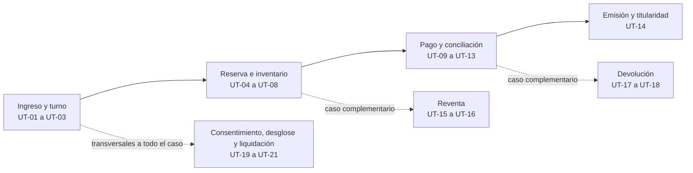

# Plan de pruebas unitarias de TicketRight

## Propósito y alcance

Este documento define **qué se va a probar, con qué datos y con qué resultado esperado**,
antes de que exista una línea de código de la implementación. Prueba que la arquitectura de
TicketRight cumple sus [atributos de calidad](../01-caso-de-negocio/atributos-de-calidad.md) y
sus [invariantes de dominio](modelo-de-dominio.md#reglas-de-negocio-e-invariantes) frente al
caso de uso elegido para esta entrega:
[comprar en la ventana de alta demanda](README.md#base-para-la-decisión-2--el-caso-de-uso),
con reventa y devolución de dinero como casos complementarios.

**Esta semana (19 de septiembre) se entrega la estrategia, la matriz caso de uso → casos de
prueba y el dato de entrada y resultado esperado de cada caso — no el código ni su
ejecución.** El [alcance confirmado de la Entrega 2](README.md#lo-primero-el-alcance-y-está-confirmado)
deja el código de las pruebas, su reporte y la cobertura medida para la Entrega 3, el 26 de
septiembre, igual que ya lo declaró el [módulo de inyección de
fallos](inyeccion-de-fallos.md#propósito-y-alcance) para su propia fase de diseño.

## Contenido

| Sección | Qué responde |
|---|---|
| [Qué se prueba y qué no](#qué-se-prueba-y-qué-no) | ¿Cuál es el alcance de estas pruebas unitarias y por qué se excluye lo demás? |
| [Dobles de prueba](#dobles-de-prueba) | ¿Qué se simula para poder probar sin dependencias externas? |
| [Casos de uso cubiertos](#casos-de-uso-cubiertos) | ¿Qué parte del recorrido de compra recibe cobertura completa y cuál solo casos borde? |
| [Matriz caso de uso → casos de prueba](#matriz-caso-de-uso--casos-de-prueba) | ¿Cuáles son los veintiún casos, con qué datos deliberados y qué resultado esperado? |
| [Cobertura y casos borde](#cobertura-y-casos-borde) | ¿Qué tipo de entrada cubre cada caso y cómo se interpretará el número de cobertura? |
| [Automatización](#automatización) | ¿Con qué se ejecutarán estas pruebas y en qué punto del flujo de construcción? |
| [Evidencia de ejecución](#evidencia-de-ejecución) | ¿Qué se reportará cuando las pruebas corran en la Entrega 3? |
| [Supuestos y pendientes](#supuestos-y-pendientes) | ¿Qué falta validar antes de escribir código? |

## Qué se prueba y qué no

**Se prueba** la lógica de dominio que hace cumplir un invariante o un escenario de calidad:
las transiciones de estado de Reserva, Pago, Boleta, Turno y Discrepancia, y las reglas R1 a
R14 del [modelo de dominio](modelo-de-dominio.md#reglas-de-negocio-e-invariantes). Son pruebas
**unitarias**: ejercitan un agregado o un caso de uso de aplicación con sus colaboradores
sustituidos por [dobles de prueba](#dobles-de-prueba), sin red, sin base de datos real y sin
la pasarela real.

**No se prueba aquí:**

| Qué queda fuera de este plan | Por qué | Dónde se cubre |
|---|---|---|
| Caída de infraestructura, red, réplicas y bases de datos reales | Es resiliencia de despliegue, no lógica de dominio | [Módulo de inyección de fallos](inyeccion-de-fallos.md) |
| Rendimiento bajo carga real (P95, throughput) | Exige un ambiente desplegado y volumetría ejecutándose | [Volumetría](volumetria.md) y la Entrega 3 |
| El comportamiento real de la pasarela, del control de acceso en la puerta o de PULEP | Son terceros fuera del alcance del negocio | [`alcance.md`, §6](../01-caso-de-negocio/alcance.md#6-fuera-de-alcance--y-por-qué) |
| Pruebas de interfaz de usuario | Corresponden al prototipo (entregable 7), no a la lógica de dominio | Prototipo de interfaz |
| Seguridad ofensiva (tokens forjados, *fuzzing*) | Es un plan de pruebas de seguridad distinto, ligado a A-11 (seguridad y privacidad de datos y operaciones) y a la decisión de identidad aislada de [AD-004](../decisiones/0004-datos-personales-almacenamiento-y-acceso.md) | Pendiente como entregable propio de la Entrega 3 |

Esta separación evita el error que castiga la rúbrica: "pruebas sueltas sin relación con los
casos de uso del proyecto". Cada caso de este plan cuelga de un invariante, un atributo o una
decisión ya escrita; no se inventa un caso para llenar una tabla.

## Dobles de prueba

Ninguna prueba unitaria de este plan llamará a un servicio externo real. Se declaran cuatro
dobles, ya anticipados por las decisiones aceptadas:

| Doble de prueba | Sustituye a | Comportamiento que debe poder configurar |
|---|---|---|
| **Pasarela de pagos simulada** | La pasarela de pagos real | Confirmar, rechazar, repetir con la misma clave de idempotencia, demorar más allá del *timeout* y responder fuera de orden. Es la misma que usará el [módulo de inyección de fallos](inyeccion-de-fallos.md#mecanismo-seleccionado) para sus perturbaciones de negocio. |
| **Reloj controlable** | `now()` del sistema | Adelantar el tiempo de forma determinista para probar expiraciones de diez minutos ([A-5](../01-caso-de-negocio/atributos-de-calidad.md#a-5--liberación-oportuna-de-reservas-abandonadas): liberación oportuna de reservas abandonadas) y quince minutos ([A-1](../01-caso-de-negocio/atributos-de-calidad.md#a-1--confiabilidad-de-la-relación-entre-pago-y-boleta): confiabilidad de la relación entre pago y boleta) sin esperar minutos reales. |
| **Emisor de eventos en memoria** | Kafka y el *outbox* de [AD-002](../decisiones/0002-mensajeria-del-bus-de-eventos.md) (la SAGA orquestada de pago y emisión) | Capturar los eventos publicados por un agregado para verificar que se emitió exactamente uno, incluso si el caso de prueba fuerza un reintento. |
| **Repositorio en memoria** | PostgreSQL como autoridad de [AD-003](../decisiones/0003-consistencia-por-tipo-de-inventario.md) (PostgreSQL como autoridad del inventario y CQRS para las consultas) | Simular colisiones de escritura concurrente sobre la misma silla o localidad, para probar la operación atómica sin levantar una base real. |

Los dobles reemplazan la infraestructura, nunca la regla de negocio: si una prueba necesita
que el doble "decida" el resultado de una transición de estado, la prueba está mal planteada
y la lógica debe vivir en el agregado, no en el doble.

## Casos de uso cubiertos

| Caso de uso | Cobertura | Por qué |
|---|---|---|
| **Comprar en la ventana de alta demanda** (fila → reserva → pago → emisión) — [principal, elegido en la reunión de equipo](README.md#base-para-la-decisión-2--el-caso-de-uso) | Completa: camino feliz, concurrencia, expiración, reintentos y discrepancia | Es la tesis del negocio y toca A-1 (relación pago–boleta), A-2 (aforo), A-3 (titularidad), A-4 (equidad de la fila), A-5 (liberación de reservas) y A-6 (prioridad de los pagos en curso) |
| **Revender una boleta** — complementario | Casos borde de las reglas de reventa (R9) | Acota el esfuerzo a lo que la rúbrica exige sin duplicar el camino feliz de reserva y pago, que ya se prueba en el caso principal |
| **Devolver el dinero de una compra** — complementario | Casos borde del plazo de retracto (R10) | Tiene una regla legal `[V]` dura y binaria —cinco días hábiles—, ideal para un caso límite, no para un recorrido completo |

Los grupos de casos de la [matriz](#matriz-caso-de-uso--casos-de-prueba) se ubican así sobre
las etapas del caso de uso principal; las ramas punteadas corresponden a los casos
complementarios, que cuelgan de un punto del recorrido sin recorrerlo completo.

## Matriz caso de uso → casos de prueba

Los datos de cada caso son deliberados: se eligieron para ejercitar un límite exacto (por
ejemplo, el minuto diez de una reserva) o una condición de error real de las decisiones
aceptadas, no para cubrir código al azar.

### Ingreso y turno — Admisión e identidad ([AD-004](../decisiones/0004-datos-personales-almacenamiento-y-acceso.md): seguridad por capas e identidad aislada, [AD-006](../decisiones/0006-escalado-programado-por-ventana-de-venta.md): sala de espera y escalado por ventana de venta)

| # | Escenario | Datos de entrada | Resultado esperado | Criterio de aceptación |
|---|---|---|---|---|
| **UT-01** | Tres fans ingresan con `ingresoEn` distinto, pero sus mensajes llegan al emisor de eventos en un orden distinto por una demora de red simulada | `fan1.ingresoEn=10:00:00.000`, `fan3.ingresoEn=10:00:00.500`, `fan2.ingresoEn=10:00:01.000`; el doble de eventos entrega primero el mensaje de `fan2` | La posición del turno sigue `ingresoEn`, no el orden de llegada al emisor: `fan1=1`, `fan3=2`, `fan2=3` | `ticketright_queue_policy_violations_total` permanece en cero (A-4, R6) |
| **UT-02** | El cliente de `fan1` reenvía la misma solicitud de ingreso tres veces por un *timeout* de red | Misma clave de idempotencia en las tres solicitudes | Se crea un único Turno; las tres respuestas devuelven el mismo `turnoId` | Ningún turno duplicado para el mismo fan y evento (A-4) |
| **UT-03** | Se intenta reservar con un turno que ya venció | Turno con `venceEn = ingresoEn + 2 min` (parámetro de prueba); intento de reserva a los 3 min | La reserva se rechaza con motivo explícito "turno vencido"; no se crea Reserva | El turno queda en `EstadoTurno.vencido` y es reconstruible (R6) |

### Reserva e inventario — Venta y recaudo ([AD-003](../decisiones/0003-consistencia-por-tipo-de-inventario.md): PostgreSQL como autoridad del inventario y CQRS para las consultas)

| # | Escenario | Datos de entrada | Resultado esperado | Criterio de aceptación |
|---|---|---|---|---|
| **UT-04** | Cien turnos válidos intentan reservar, al mismo instante, la misma silla numerada — la prueba mínima literal de [A-2 y A-3](../01-caso-de-negocio/atributos-de-calidad.md#a-2--integridad-del-aforo) | Una silla en estado `libre`; 100 solicitudes concurrentes de reserva sobre `sillaId` idéntico | Exactamente una reserva queda `vigente`; 99 se rechazan con "silla no disponible" | `ticketright_oversell_total = 0` y `ticketright_invalid_ownership_total = 0` (A-2, A-3, R2) |
| **UT-05** | Se solicita más inventario del que queda en una localidad general | `Aforo{autorizado:50, reservado:48, vendido:0}`; ítem solicita `cantidad=5` | El ítem completo se rechaza; el aforo no cambia | `reservado + vendido` nunca supera `autorizado` (R1) |
| **UT-06** | Se solicita exactamente el remanente de una localidad general | Mismo aforo que UT-05; ítem solicita `cantidad=2` | La reserva se acepta; `aforo.reservado` pasa a 50 | Una solicitud posterior de `cantidad=1` se rechaza (R1) |
| **UT-07** | Una reserva sin pago llega y supera el límite de expiración | Reserva creada en `t=0` (`venceEn = 10:00`); reloj de prueba avanza a `t=09:59` y luego a `t=10:00` exactos | A `t=09:59` la reserva sigue vigente; a `t=10:00` —`ahora ≥ venceEn`— pasa a `vencida` y libera sus ítems, como fija R3 | `ticketright_overdue_reservations` vuelve a cero tras el ciclo del *worker* (A-5, R3) |
| **UT-08** | El *worker* de expiración se ejecuta sobre una reserva vencida por tiempo que ya tiene un pago confirmado | Reserva con `creadaEn` hace 11 minutos y `Pago.estado = confirmado` | El *worker* **no** cambia el estado de la reserva ni libera el ítem | Ninguna reserva con pago confirmado se libera como abandonada (A-5, excepción explícita) |

### Pago y conciliación — SAGA de venta ([AD-002](../decisiones/0002-mensajeria-del-bus-de-eventos.md): orquestación con eventos durables para pago y emisión)

| # | Escenario | Datos de entrada | Resultado esperado | Criterio de aceptación |
|---|---|---|---|---|
| **UT-09** | La pasarela simulada envía dos veces el mismo *webhook* de confirmación — la prueba mínima literal de [A-1](../01-caso-de-negocio/atributos-de-calidad.md#a-1--confiabilidad-de-la-relación-entre-pago-y-boleta) | `claveIdempotencia=X` en ambos envíos, separados tres segundos | Una sola transición a `confirmado`; una sola boleta emitida | El segundo *webhook* no produce efecto ni abre Discrepancia (A-1) |
| **UT-10** | La pasarela responde después del *timeout* del cliente | `gateway_profile=tardío`, demora simulada de 45 s contra un *timeout* de cliente de 30 s | El pago permanece en `pendientePasarela`; al llegar la respuesta tardía, la SAGA retoma el flujo hasta boleta emitida o compensación | Cero cobros duplicados; resolución dentro de 15 minutos (A-1) |
| **UT-11** | La pasarela rechaza el cobro | Respuesta `rechazado` para `claveIdempotencia=Y` | La reserva pasa a `cancelada`; el ítem libera inventario en la misma transición lógica | No se crea Discrepancia: es un rechazo explícito, no una ambigüedad (R4) |
| **UT-12** | El pago se confirma, pero el servicio de emisión (doblado) falla de forma repetida | Cinco fallos consecutivos del doble de emisión tras `Pago.confirmado` | Al agotar los reintentos configurados, se abre una Discrepancia `cobroSinBoleta` | `resueltaEn` queda nulo; `ticketright_oldest_discrepancy_age_seconds` empieza a contar desde `confirmadoEn` (A-1, R5, R14) |
| **UT-13** | El servicio de emisión se recupera dentro del plazo, continuando UT-12 | El doble de emisión responde con éxito al quinto minuto | La Discrepancia se cierra con `resolucion=emisionCompletada`; la boleta queda emitida referenciando el pago original | Cierre antes de los 15 minutos (A-1, R14) |

### Derecho de asistencia — titularidad ([modelo de dominio](modelo-de-dominio.md#derecho-de-asistencia))

| # | Escenario | Datos de entrada | Resultado esperado | Criterio de aceptación |
|---|---|---|---|---|
| **UT-14** | Dos transferencias concurrentes sobre la misma boleta hacia fans distintos — la prueba mínima literal de [A-3](../01-caso-de-negocio/atributos-de-calidad.md#a-3--unicidad-de-la-titularidad-de-una-boleta) | Mismo `titularidadId` de origen; dos `fanDestinoId` distintos, solicitadas al mismo instante | Solo una transferencia queda `aceptada`; la otra recibe el estado vigente y no crea una segunda titularidad activa | `Código.version` incrementa una sola vez (A-3, R7, R8) |

### Reventa — caso complementario ([R9](modelo-de-dominio.md#reglas-de-negocio-e-invariantes): la reventa solo existe dentro de la ventana y el precio máximo que define el evento)

| # | Escenario | Datos de entrada | Resultado esperado | Criterio de aceptación |
|---|---|---|---|---|
| **UT-15** | Se publica una reventa después del cierre de la ventana permitida | `Reglas de reventa.ventana = [1 sep, 10 sep]`; publicación intentada el 11 sep | La publicación se rechaza; la boleta conserva su titular actual | Ninguna Reventa se crea fuera de `ventana` (R9) |
| **UT-16** | Se publica una reventa por encima del precio máximo configurado | `precioMaximo = $300.000`; precio publicado `= $305.000` | La publicación se rechaza | Ninguna Reventa se crea con `precio > precioMaximo` (R9) |

### Devolución — caso complementario ([R10](modelo-de-dominio.md#reglas-de-negocio-e-invariantes): una devolución aprobada anula la boleta; el retracto solo aplica dentro de los cinco días hábiles de Ley 1480 art. 47 `[V]`)

| # | Escenario | Datos de entrada | Resultado esperado | Criterio de aceptación |
|---|---|---|---|---|
| **UT-17** | Se solicita el retracto dentro de los cinco días hábiles siguientes a la compra | Compra confirmada el martes 10:00 a. m.; retracto solicitado el viernes de la misma semana (tercer día hábil) | La devolución queda `aprobada`, la boleta queda `anulada` y se genera un Movimiento `devolucion` | Nunca coexisten boleta usable y dinero devuelto (R10) |
| **UT-18** | Se solicita el retracto después del plazo legal | Misma compra; retracto solicitado en el sexto día hábil | La solicitud se rechaza con motivo "plazo vencido" | La boleta permanece vigente y no se genera Movimiento (R10, Ley 1480 art. 47 `[V]`) |

### Reglas transversales — consentimiento, desglose y liquidación ([R11, R12 y R13](modelo-de-dominio.md#reglas-de-negocio-e-invariantes))

| # | Escenario | Datos de entrada | Resultado esperado | Criterio de aceptación |
|---|---|---|---|---|
| **UT-19** | El promotor solicita los datos de un fan cuyo consentimiento para esa finalidad fue revocado — [R11](modelo-de-dominio.md#reglas-de-negocio-e-invariantes) y [AD-004](../decisiones/0004-datos-personales-almacenamiento-y-acceso.md) | Fan con `Consentimiento{finalidad: transferenciaAlPromotor, otorgadoEn: 1 sep, revocadoEn: 5 sep}`; solicitud el 6 sep | La transferencia se deniega y el intento queda registrado; los datos de `Identidad` no salen del contexto | Solo un consentimiento con `revocadoEn` vacío para **esa** finalidad habilita la entrega; otra finalidad vigente (`emision`) no la habilita |
| **UT-20** | Se desglosa el precio de un ítem por encima y por debajo del umbral parafiscal — [R13](modelo-de-dominio.md#reglas-de-negocio-e-invariantes), Ley 1493 `[V]` | `CalculadoraDePrecio` instanciada con el `Convenio` vigente del promotor (`cargoServicio: 12%` `[S]`), `tasaParafiscal: 10%` y `umbralParafiscal: 3 UVT`; nominal A = $200.000 (≥ 3 UVT), nominal B = $100.000 (< 3 UVT) `[S]` valor de la UVT del año | A: `cargoServicio = $24.000`, `contribucionParafiscal = $20.000`, total `$244.000`; B: `cargoServicio = $12.000`, `contribucionParafiscal = $0`, total `$112.000` | `Reserva.total` y `Pago.monto` son la suma de los desgloses; el desglose se guarda calculado y un cambio posterior de tarifa no altera el ítem |
| **UT-21** | Se intenta cerrar una liquidación con una discrepancia abierta y luego con todo conciliado — [R12](modelo-de-dominio.md#reglas-de-negocio-e-invariantes) y [R14](modelo-de-dominio.md#reglas-de-negocio-e-invariantes) | Liquidación con movimientos `venta $400.000`, `parafiscal $40.000`, `participaciones $24.000`, `devolucion $200.000`; una `Discrepancia{tipo: cobroSinBoleta, resueltaEn: vacío}` sobre uno de sus pagos | Primer intento: el cierre se rechaza y la liquidación queda `enConciliacion`; tras resolver la discrepancia, cierra con `neto = 400.000 + 40.000 + 24.000 − 200.000 = $264.000` | Una liquidación `cerrada` solo contiene movimientos con `conciliadoEn` y cumple `neto = bruto + parafiscalRecaudado + participaciones − devoluciones` |

## Cobertura y casos borde

Los veintiún casos incluyen deliberadamente:

- **Caminos felices:** UT-04 (la reserva que gana), UT-06, UT-09 (la primera confirmación),
  UT-13, UT-17.
- **Valores límite:** UT-07 (el minuto diez exacto), UT-06 (el remanente exacto de una
  localidad), UT-17/UT-18 (el tercer día hábil frente al sexto), UT-20 (el umbral de 3 UVT).
- **Entradas inválidas o fuera de regla:** UT-05, UT-15, UT-16, UT-18, UT-19, UT-21.
- **Condiciones de error de un tercero:** UT-10 (respuesta tardía), UT-12 (servicio de
  emisión caído).
- **Reglas de negocio críticas bajo concurrencia:** UT-01, UT-02, UT-04, UT-08, UT-14.

Cuando exista código, el número de cobertura de líneas o ramas se reportará **junto con su
interpretación**, como exige la rúbrica: un módulo con 100% de cobertura pero sin un caso de
concurrencia o de expiración no demuestra lo que este plan exige. La meta de referencia será
que **cada regla R1 a R14 y cada escenario A-1 a A-6 con prueba mínima declarada en
[`atributos-de-calidad.md`](../01-caso-de-negocio/atributos-de-calidad.md) tenga al menos un
caso de este plan** antes de mirar el porcentaje agregado.

## Automatización

La [arquitectura de implementación](arquitectura-de-implementacion.md) fija la topología, y
[AD-007](../decisiones/0007-stack-de-implementacion.md) fija el lenguaje y el marco de
pruebas —TypeScript sobre Node.js con Vitest, aceptado el 20 de septiembre de 2026—. Lo que
sí se fija aquí, porque depende del diseño de dominio y no de la tecnología:

- Las pruebas unitarias vivirán junto al código de cada contexto acotado (Oferta de eventos,
  Admisión e identidad, Venta y recaudo, Derecho de asistencia), nunca en un módulo aparte que
  pueda desincronizarse del dominio.
- Se ejecutarán en cada *commit* y en cada solicitud de cambio, antes de las pruebas de
  integración o de los experimentos del [módulo de inyección de fallos](inyeccion-de-fallos.md),
  que son más lentos y dependen de un ambiente desplegado.
- Un cambio que rompa un caso de este plan bloqueará la integración: es la forma concreta de
  proteger [A-12](../01-caso-de-negocio/atributos-de-calidad.md#a-12--modificabilidad-de-políticas-de-venta),
  que exige que una política nueva no obligue a tocar los contratos de inventario y pago.
- Los cuatro dobles de prueba se versionarán junto con el código de dominio, no dentro de la
  infraestructura de despliegue, porque representan un contrato de comportamiento, no un
  ambiente.

## Evidencia de ejecución

**Estado al 20 de septiembre de 2026: los veintiún casos están implementados y en verde.**
El código vive junto a cada contexto y la primera ejecución completa reportó **38 pruebas
aprobadas** —las veintiuno de esta matriz más las de estructura hexagonal de cada paquete—
con una cobertura de **78,25% de sentencias y 58,82% de ramas**, medida con V8
(`npm run test:coverage`). Interpretación: la cobertura cubre los caminos que cada caso
declara; lo que falta son adaptadores, proyecciones y transacciones reales, que no
pertenecen a este plan porque exigen infraestructura desplegada. Se ejecutan con `npm test`
y el CI las corre en cada push y cada pull request.

**Al cierre de la Entrega 3 (26 de septiembre)** el conjunto creció a **63 pruebas**: 58
unitarias —los veintiún casos, las de estructura y las del dominio de `event-catalog`— y 5 de
integración contra PostgreSQL. En el CI de `main` pasan las 63, con **78,8 % de sentencias y
59,6 % de ramas**.

**Dónde vive cada caso:**

| Casos | Archivo | Paquete |
|---|---|---|
| UT-01 a UT-03 | `tests/ut-01-03-queue.test.ts` | `@ticketright/admission-identity` |
| UT-04 a UT-08 | `tests/ut-04-08-reservation.test.ts` | `@ticketright/sales` |
| UT-09 a UT-13 | `tests/ut-09-13-payment.test.ts` | `@ticketright/sales` |
| UT-14 | `tests/ut-14-titularity.test.ts` | `@ticketright/entitlements` |
| UT-15 y UT-16 | `tests/ut-15-16-resale.test.ts` | `@ticketright/entitlements` |
| UT-17 y UT-18 | `tests/ut-17-18-refund.test.ts` | `@ticketright/sales` |
| UT-19 | `tests/ut-19-consent.test.ts` | `@ticketright/admission-identity` |
| UT-20 | `tests/ut-20-pricing.test.ts` | `@ticketright/sales` |
| UT-21 | `tests/ut-21-settlement.test.ts` | `@ticketright/sales` |

En esta fase se define el diseño: estrategia, matriz y datos. La ejecución real, el reporte
de resultados y la cobertura medida corresponden a la Entrega 3, igual que lo declaran
[observabilidad](observabilidad.md#validación-posterior-del-diseño) y
[inyección de fallos](inyeccion-de-fallos.md#propósito-y-alcance) para sus propias fases de
implementación. Cuando existan, se conservarán:

- el resultado de cada uno de los veintiún casos (aprobado o fallido) con su *commit*;
- todo defecto encontrado, su corrección y la nueva ejecución que lo confirma;
- el reporte de cobertura por contexto acotado, con la interpretación exigida arriba;
- la integración de estas pruebas en el flujo de construcción, con evidencia de que
  bloquearon al menos un cambio antes de llegar a la Entrega 3.

## Supuestos y pendientes

- `[S]` Los cuatro dobles de prueba (pasarela simulada, reloj, emisor de eventos y
  repositorio en memoria) son suficientes para probar la lógica de dominio sin infraestructura
  real. Se revisará si la arquitectura de implementación introduce un colaborador que estos
  dobles no puedan representar.
- El límite de A-5 · liberación en ≤ 10 min se prueba en UT-07 tal como lo fija R3 del
  modelo de dominio: la reserva deja de estar vigente **desde** `venceEn = creadaEn + 10 min`,
  de modo que a los diez minutos exactos ya no bloquea inventario. El valor de diez minutos
  sigue `[S]` hasta la ratificación de umbrales de
  [`atributos-de-calidad.md`](../01-caso-de-negocio/atributos-de-calidad.md#ratificación-pendiente-del-equipo).
- **Stack fijado:** [AD-007](../decisiones/0007-stack-de-implementacion.md) quedó aceptado el
  20 de septiembre de 2026 —TypeScript sobre Node.js, Vitest y cobertura V8—.
- ✅ El código de los veintiún casos está escrito y en verde; `PENDIENTE: anexar el reporte
  de cobertura al paquete de la Entrega 3 y conservar la evidencia por *commit*.`

## Referencias

- [`atributos-de-calidad.md`](../01-caso-de-negocio/atributos-de-calidad.md) — escenarios y
  "prueba mínima" de cada atributo, base directa de esta matriz.
- [`modelo-de-dominio.md`](modelo-de-dominio.md#reglas-de-negocio-e-invariantes) — las
  catorce reglas R1 a R14.
- [AD-002](../decisiones/0002-mensajeria-del-bus-de-eventos.md),
  [AD-003](../decisiones/0003-consistencia-por-tipo-de-inventario.md) y
  [AD-006](../decisiones/0006-escalado-programado-por-ventana-de-venta.md) — los mecanismos
  que estos casos ponen a prueba.
- [`alcance.md`, §6](../01-caso-de-negocio/alcance.md#6-fuera-de-alcance--y-por-qué) — la
  frontera que excluye control de acceso, pasarela real y PULEP de este plan.
- [Rúbrica, criterio 9](rubrica.md#9-plan-de-pruebas-unitarias).
