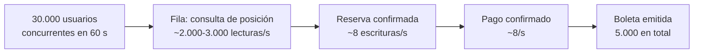

# Volumetría de TicketRight para pruebas

## Propósito y alcance

Este documento traduce el negocio y los atributos de calidad en **números concretos**: cuántos
datos existen, cuántos usuarios concurren, cuántas transacciones por segundo debe sostener el
núcleo y bajo qué escenarios se probará. Es el entregable 10 — **0% de la nota, bonificación
de hasta +0,25** — pero alimenta directamente la [arquitectura de referencia](rubrica.md#3-arquitectura-de-referencia)
y el [plan de pruebas](plan-de-pruebas.md): sin esta cifra no hay carga contra la cual correr
ni un escenario de A-7 (eficiencia de costos por boleta vendida) y A-10 (rendimiento de fila
y reserva) que verificar.

**Esta semana (19 de septiembre) se entregan las cifras y los escenarios de carga con sus
criterios de aceptación — no las corridas.** El
[alcance confirmado de la Entrega 2](README.md#lo-primero-el-alcance-y-está-confirmado) deja
la ejecución real de estos escenarios para la Entrega 3, el 26 de septiembre.

## Contenido

| Sección | Qué responde |
|---|---|
| [Volúmenes de datos](#volúmenes-de-datos) | ¿Cuántos registros existen hoy y cuántos habrá en doce meses, por entidad? |
| [Usuarios y perfiles de carga](#usuarios-y-perfiles-de-carga) | ¿Cuántos usuarios, con qué comportamiento y en qué distribución de tiempo? |
| [Transacciones](#transacciones) | ¿Cuántas operaciones por segundo, con qué relación lectura/escritura y qué tiempo de respuesta objetivo? |
| [Escenarios de prueba](#escenarios-de-prueba) | ¿Qué se ejecutará en nominal, pico, estrés y resistencia, y cuál es el punto de quiebre esperado? |
| [Relación con observabilidad y pruebas](#relación-con-observabilidad-y-pruebas) | ¿Cómo se mide cada escenario cuando exista implementación? |
| [Supuestos y pendientes](#supuestos-y-pendientes) | ¿Qué cifra sigue sin validar y quién debe hacerlo? |

## Volúmenes de datos

Dos anclas ya ratificadas en el equipo dan el punto de partida: la
[proyección financiera a 12 meses](../01-caso-de-negocio/modelo-financiero.md#6-proyección-a-12-meses)
(T1: 2 eventos/mes, 15.200 boletas; T4: 20 eventos/mes, 152.000 boletas) y el **evento tipo**
de [AD-003](../decisiones/0003-consistencia-por-tipo-de-inventario.md#4-supuestos) —8.000
puestos, 7.600 vendidos, 95% de ocupación—, que coincide con el promedio de boletas por evento
de la propia proyección (152.000 ÷ 20 = 7.600). Esa coincidencia es la que permite usar un solo
evento tipo para dimensionar el resto de la tabla.

| Entidad (raíz del [modelo de dominio](modelo-de-dominio.md#agregados-entidades-y-objetos-de-valor)) | Volumen inicial (T1, mes 3) | Volumen en régimen (T4, mes 12) | Tamaño aproximado por registro `[S]` | Fuente o supuesto |
|---|---|---|---|---|
| **Evento** | 2/mes → 6 acumulados | 20/mes → 240/año | ~1 KB | [Proyección a 12 meses](../01-caso-de-negocio/modelo-financiero.md#6-proyección-a-12-meses) `[S]` |
| **Localidad** | ~6/mes | ~60/mes | ~0,5 KB | `[S]` 3 localidades por evento en promedio (general, preferencial, VIP); sin validar con un promotor real |
| **Silla** | ~6.400/mes | ~64.000/mes | ~0,2 KB | `[S]` 40% del aforo del evento tipo es localidad numerada (3.200 de 8.000); vive mientras el evento está activo y puede archivarse después |
| **Fan** (participación) | ~10.900/mes | ~108.600/mes | ~0,3 KB | `[S]` boletas ÷ 1,4 boletas por fan en promedio; **sin validar**, depende de la tasa de recompra y del `limitePorFan` real |
| **Identidad** | Igual a Fan nuevos | Igual a Fan nuevos, con recompra acumulada | ~0,5 KB | Vive en almacén aislado por [AD-004](../decisiones/0004-datos-personales-almacenamiento-y-acceso.md); un mismo fan no crea una identidad nueva en cada compra |
| **Turno** | Depende del perfil del evento — ver [Usuarios y perfiles de carga](#usuarios-y-perfiles-de-carga) | — | ~0,3 KB | En perfil cotidiano ≈ 1,1 × boletas (poco abandono); en perfil masivo, la carga objetivo declarada (30.000 por evento) domina el cálculo |
| **Reserva** | ~13.000/mes | ~130.400/mes | ~0,5 KB | `[S]` boletas ÷ 1,4 × 1,15 (15% de reservas no llegan a pago y expiran, A-5: liberación oportuna de reservas abandonadas) |
| **Pago** | ~13.000/mes | ~130.400/mes | ~1 KB | `[S]` una reserva pagada produce un pago; se suman los pagos de reventa |
| **Discrepancia** | < 20/mes | < 200/mes | ~0,3 KB | `[S]` objetivo operativo de menos del 0,15% de los pagos, no una meta de A-1 (confiabilidad de la relación entre pago y boleta) —A-1 exige cero **abiertas al cierre**, no cero **generadas** |
| **Boleta** | 15.200/mes → 45.600 acumuladas en T1 | 152.000/mes | ~1,5 KB (incluye código QR y su historial de versiones) | Proyección financiera; retención mínima de 24 meses por A-8 (trazabilidad completa de una venta) |
| **Liquidación** | 2/mes (una por promotor activo) | 18/mes | ~1 KB | Un cierre por promotor y periodo |
| **Movimiento** | ~15.500/mes | ~155.000/mes | ~0,3 KB | `[S]` un movimiento por boleta vendida, más devoluciones y reventas |

El crecimiento **no es indefinido en todas las tablas**: Silla y Turno están acotados al ciclo
de vida de un evento y pueden archivarse una vez cerrada su liquidación; Boleta, Movimiento y
Discrepancia deben conservarse activos durante los 24 meses que exige A-8 antes de mover el
histórico a un almacén de auditoría más barato.

## Usuarios y perfiles de carga

| Perfil operativo | Usuarios concurrentes | Comportamiento | Distribución |
|---|---|---|---|
| **Cotidiano** (`ModoAdmision.pasoDirecto`) | `[S]` ≤ 50 usuarios concurrentes explorando catálogo; reservas esporádicas, del orden de una por minuto | Navegación de catálogo, compra individual sin fila visible, consulta de boletas propias | Disperso durante el día, sin ventana anunciada |
| **Masivo** (`ModoAdmision.filaVisible`) — carga objetivo declarada `[S]` | **30.000 usuarios concurrentes en 60 segundos**, compitiendo por **5.000 boletas** | La mayoría solo consulta posición en fila; una fracción decreciente intenta reservar, paga y recibe boleta | Concentrado en la hora de apertura anunciada del evento; el resto del mes ese mismo evento no genera tráfico relevante |

La carga masiva es la que ya ratificó el equipo para
[A-7](../01-caso-de-negocio/atributos-de-calidad.md#a-7--eficiencia-de-costos-por-boleta-vendida)
(eficiencia de costos por boleta vendida) y
[A-10](../01-caso-de-negocio/atributos-de-calidad.md#a-10--rendimiento-de-fila-y-reserva)
(rendimiento de fila y reserva); este documento no define una cifra nueva, la usa como ancla
de todo lo demás.

> **Tres cifras, tres cosas distintas.** Conviven en el proyecto y no se contradicen: el
> **evento tipo de 8.000 puestos / 7.600 vendidos** es la unidad del modelo financiero y de
> esta volumetría (cuánto se vende al mes); los **5.000 boletas en 60 segundos** son la
> **carga de prueba**, deliberadamente más concentrada que el evento tipo —el 60% del aforo
> en el primer minuto— para ejercitar A-7 y A-10 en el peor caso creíble; y el aforo de
> **5.800** del prototipo (General 5.000 + Platino 800) es un dato de ejemplo de las
> pantallas, elegido para que la localidad general coincida con la carga de prueba. Ninguna
> de las tres reemplaza a las otras.

**Usuarios totales por evento tipo** (30.000) frente a **boletas disponibles** (5.000) da una
proporción de **6 personas por boleta**: es la que justifica que la fila sea obligatoria en
este perfil y que ninguna proyección de disponibilidad pueda autorizar una emisión
([AD-003](../decisiones/0003-consistencia-por-tipo-de-inventario.md): PostgreSQL como
autoridad del inventario).

`PENDIENTE: la distribución estacional real —cuántos eventos de alta demanda caen el mismo fin
de semana, temporada alta de conciertos en Colombia— no está validada. El calendario de PULEP
podría acotarla; responsable: Lina.`

## Transacciones

Los números siguientes se derivan de la carga masiva declarada y de los parámetros ya
aceptados en los ADR, no de una tasa inventada:

| Operación | Cálculo | Resultado `[S]` | Tiempo de respuesta objetivo |
|---|---|---|---|
| **Ingreso a la fila** (escritura de Turno) | 30.000 usuarios ÷ 60 s | **~500 ingresos/s** en la ráfaga inicial | Sin objetivo propio; alimenta la fila, no el checkout |
| **Consulta de posición** (lectura, Redis) | 30.000 turnos × 1 consulta cada 10–15 s ([supuesto de AD-006](../decisiones/0006-escalado-programado-por-ventana-de-venta.md#4-supuestos)), sostenida durante una ventana de drenaje de `[S]` ~10 minutos hasta agotar el inventario | **~2.000–3.000 consultas/s** sostenidas mientras la fila drena | P95 ≤ 1 s ([A-10](../01-caso-de-negocio/atributos-de-calidad.md#a-10--rendimiento-de-fila-y-reserva)) — métrica `ticketright_queue_position_duration_seconds` |
| **Confirmación o rechazo de reserva** (escritura crítica, PostgreSQL) | 5.000 boletas objetivo ÷ ~10 minutos de drenaje | **~8 reservas confirmadas/s** en promedio; los intentos sobre las últimas unidades de una localidad pueden multiplicar esa tasa en solicitudes rechazadas (ver [UT-04](plan-de-pruebas.md#reserva-e-inventario--venta-y-recaudo-ad-003-postgresql-como-autoridad-del-inventario-y-cqrs-para-las-consultas): cien solicitudes concurrentes sobre la misma silla) | P95 ≤ 2 s, error técnico < 1% (A-10) — métrica `ticketright_reservation_duration_seconds` |
| **Pago iniciado / confirmado** | Sigue la tasa de reservas confirmadas | **~8/s** en promedio, con ráfagas menores por reintentos de la pasarela | ≥ 99% de los pagos iniciados alcanza un estado final bajo saturación (A-6) — métrica `ticketright_payments_total` |
| **Emisión de boleta** | Sigue la tasa de pagos confirmados | **~8/s** en promedio | Dentro de los 15 minutos de A-1 si hay reintento; inmediata en el camino feliz |

**Relación lectura/escritura:** aproximadamente **250 a 300 lecturas por cada escritura
crítica** durante el pico (2.000–3.000 consultas/s de posición y catálogo frente a ~8–10
escrituras/s hacia PostgreSQL), como se ve al recorrer la carga objetivo por etapa:

Esta proporción es, en números, la razón de ser de
[CQRS](../decisiones/0003-consistencia-por-tipo-de-inventario.md) y de la
[sala Space-Based bajo demanda](../decisiones/0006-escalado-programado-por-ventana-de-venta.md):
ninguna base transaccional debe absorber ese volumen de lectura sin poner en riesgo la
escritura que sí protege dinero e inventario.

## Escenarios de prueba

| Escenario | Carga | Objetivo | Criterio de aceptación |
|---|---|---|---|
| **Nominal** | Perfil cotidiano: ≤ 50 usuarios concurrentes, reservas esporádicas | Confirmar que la operación diaria cumple A-9 (disponibilidad durante la ventana de venta) con la capacidad mínima y sin activar la sala Space-Based | Disponibilidad ≥ 99,9%; costo de infraestructura en su piso mínimo; cero turnos creados fuera de `pasoDirecto` |
| **Pico** | La carga objetivo declarada: 30.000 usuarios en 60 s contra 5.000 boletas, con precalentamiento de 30 minutos y ventana de capacidad alta de tres horas ([supuestos de AD-006](../decisiones/0006-escalado-programado-por-ventana-de-venta.md#4-supuestos)) | Verificar A-2 (aforo), A-4 (equidad de la fila), A-6 (prioridad de los pagos en curso), A-7 (costo ≤ COP $150/boleta) y A-10 (rendimiento) bajo la carga íntegra declarada | Cero sobreventa; ≥ 99% de pagos iniciados completados; P95 dentro de los umbrales de A-10; costo por boleta dentro del techo de A-7 |
| **Estrés** | 1,5× y 2× la carga objetivo (45.000 y 60.000 usuarios en 60 s) contra el mismo inventario de 5.000 boletas | Encontrar el punto en que la latencia o la admisión dejan de sostener el objetivo, sin que eso comprometa el aforo | La garantía de A-2 (cero sobreventa) **nunca** puede fallar, aunque A-9 (disponibilidad) o A-10 (rendimiento) se degraden; se documentará en qué multiplicador la válvula de admisión debe reducirse a su mínimo. `[S]` Se estima que la degradación empieza entre 1,5× y 2×: el perfil Fargate de la sala de espera en [`arquitectura-de-implementacion.md`](arquitectura-de-implementacion.md#grupos-de-nodos-y-capacidad) tiene techo fijo de **0/60 tareas**, dimensionado para los 30.000 usuarios del escenario de pico y sin margen adicional reservado; los otros topes de seguridad declarados ahí (réplicas máximas por servicio, tasa de admisión, presupuesto de conexiones en RDS Proxy) actúan en el mismo rango. `PENDIENTE: confirmar el multiplicador exacto de quiebre en la Entrega 3, ejecutando el escenario contra esos techos` |
| **Resistencia (*soak*)** | Sostener el perfil de pico durante las tres horas completas de la ventana de capacidad alta declarada | Detectar fugas de memoria, crecimiento sostenido del *lag* de Kafka, agotamiento de conexiones de PostgreSQL o divergencia acumulada entre Redis y la autoridad transaccional | Ningún indicador de diagnóstico crece de forma monótona sin estabilizarse; al drenar, cero discrepancias abiertas y cero reservas vencidas sin liberar |

Los cuatro escenarios comparten el mismo inventario objetivo (5.000 boletas) para que el
resultado sea comparable entre corridas: lo que cambia es la presión de usuarios, no el premio
que están compitiendo por ganar.

## Relación con observabilidad y pruebas

Esta volumetría no se prueba sola. Es la carga que:

- ejecutan los cinco experimentos del [módulo de inyección de fallos](inyeccion-de-fallos.md#experimentos-prioritarios),
  que hoy usan valores de partida provisionales `[S]` mientras esta cifra no estaba escrita;
- mide la [plataforma de observabilidad](observabilidad.md#catálogo-de-métricas-y-objetivos) con
  las métricas ya nombradas en la tabla de [Transacciones](#transacciones);
- reproduce el [plan de pruebas unitarias](plan-de-pruebas.md) en sus casos de concurrencia
  —UT-04 (cien solicitudes sobre la misma silla), UT-09 (*webhook* de pago duplicado) y
  UT-14 (transferencias concurrentes sobre la misma boleta)—, aunque esos casos se ejercitan
  con un número pequeño y deliberado de solicitudes, no con el volumen completo: la
  volumetría es el nivel de carga; el plan de pruebas es la corrección de la lógica bajo ese
  tipo de carga.

## Supuestos y pendientes

- `[S]` La ventana de drenaje de la fila hasta agotar las 5.000 boletas es de ~10 minutos.
  `PENDIENTE: no está validada; condiciona directamente la tasa de escritura crítica calculada
  arriba.`
- `[S]` 1,4 boletas por fan y 15% de abandono de reserva son supuestos de partida sin dato de
  mercado. `PENDIENTE: responsable de validar con el promotor piloto: Quinnie`, según el mismo
  criterio que ya aplica a otros supuestos de reventa y precio en el
  [alcance del negocio](../01-caso-de-negocio/alcance.md#5-alcance--qué-entra).
- `[S]` La mezcla de 40% de localidad numerada frente a general del evento tipo no está
  validada. `PENDIENTE: validar la mezcla con el promotor piloto`, como ya señala
  [AD-003](../decisiones/0003-consistencia-por-tipo-de-inventario.md#4-supuestos).
- `PENDIENTE: ejecutar los cuatro escenarios contra la implementación en la Entrega 3 y
  reemplazar cada cifra `[S]` de este documento por una medida real.` Primera campaña, a
  escala reducida y en el ambiente local, el 22 de septiembre de 2026:
  [`pruebas-de-carga.md`](../03-implementacion/pruebas-de-carga.md).

## Referencias

- [Proyección financiera a 12 meses](../01-caso-de-negocio/modelo-financiero.md#6-proyección-a-12-meses).
- [`atributos-de-calidad.md`](../01-caso-de-negocio/atributos-de-calidad.md) — A-7 y A-10, origen
  de la carga objetivo de 30.000 usuarios y 5.000 boletas.
- [AD-003](../decisiones/0003-consistencia-por-tipo-de-inventario.md) y
  [AD-006](../decisiones/0006-escalado-programado-por-ventana-de-venta.md) — mecanismos que esta
  volumetría pone a prueba.
- [`observabilidad.md`](observabilidad.md#catálogo-de-métricas-y-objetivos) y
  [`inyeccion-de-fallos.md`](inyeccion-de-fallos.md) — dónde se mide y se perturba esta carga.
- [`plan-de-pruebas.md`](plan-de-pruebas.md) — la corrección funcional bajo el mismo caso de uso.
- [Rúbrica, criterio 10](rubrica.md#10-definición-de-volumetría-para-pruebas).
